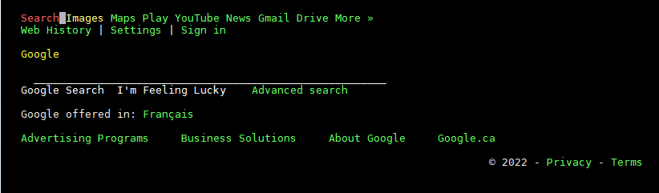
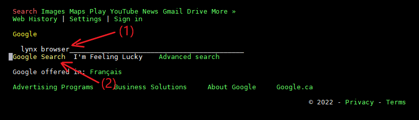
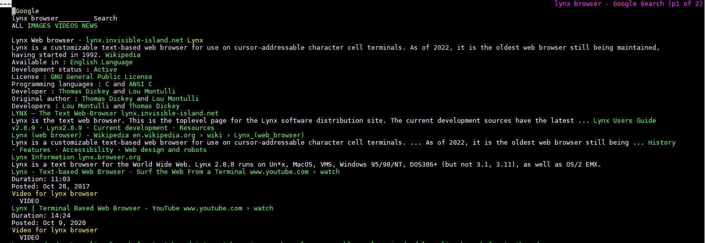

# Mock Test with Course Grader

## Using Course Grader on Raspberry Pi with Lynx 

This section describes how to submit your code using the [Lynx text-based web browser](https://lynx.invisible-island.net/lynx.html) with your Raspberry Pi
in Lab rooms A4083 or A4085.

### Prerequisites

1. Your Pi needs to be able to connect to the internet in Lab rooms A4083 or A4085
1. Install the Lynx text-based web browser:

    `sudo apt-get install lynx`

Lynx can be used to navigate most web-sites, familiarize yourself on its use by testing with a common search engine.  

1. Practice navigating to: `lynx www.google.com`
    1. Answer `Yes` when prompted by Lynx
    1. Your screen should look like below

        
    1. Enter a search for the term `lynx browser`
        1. Navigate to the search field
        1. Navigate to `Google Search` field

        
    
    1. After running the search, your results should look similar to below:

        


Some helpful references for using Lynx:

1. [Lynx User Guide](https://lynx.invisible-island.net/lynx_help/Lynx_users_guide.html)
1. [Quitting Lynx](https://lynx.invisible-island.net/lynx_help/Lynx_users_guide.html#Leaving)
1. [Navigating hypertext documents with Lynx](https://lynx.invisible-island.net/lynx_help/Lynx_users_guide.html#IntraDocNav)
1. [Getting help while in Lynx](https://lynx.invisible-island.net/lynx_help/Lynx_users_guide.html#Help)

## Submitting Code to Course Grader with Lynx Text-based Web-Browser

1. Ensure you're working with the [latest version of course repository](../references/Tips_and_Tricks.md#updating-local-course-repository-from-github)
1. Copy mock test solution file `mySenecaID_PRG550A.222.MOCK.py` to `workspace` folder
    ```    
        cp /home/pi/seneca-prg550-2022-spring/labs/mySenecaID_PRG550A.222.MOCK.py /home/pi/workspace/labs
    ```
1. Rename `mySenecaID_PRG550A.222.MOCK.py` to match your own `studentID` and `section`.  For example:  `tswift_PRG550B.222.MOCK.py`

1. Change to workspace `labs` directory and start Lynx 
    ```
        cd /home/pi/workspace/labs
    ```
1. Connect Lynx to the mock-test grader:
    ```
        lynx http://www.doralee.ca/courses/prg550/mock/prg550.222.mock.html
    ```
1. Use arrow keys to navigate between form fields
    1. Select File to Upload --> use full path `/home/pi/workspace/labs/tswift_PRG550B.222.MOCK.py`
    1. Enter your 9 digit student number --> `123456789`
    1. Select your PRG550 Section --> select `PRG550A` or `PRG550B`
    1. Enter YOUR course PASSWORD
    1. Navigate to `Submit Lab` and press `ENTER`
    1. Press `q` to exit Lynx
    1. Check your email to confirm successful submission


## Submitting Code Using Course Grader with Conventional Web Browser
This section describes how to submit your code to the course grader for the lab tests **on campus** in rooms A4083 or A4085

1. The mock test requirements and submission page link:  [PRG550 Summer Mock Test](http://www.doralee.ca/courses/prg550/mock/prg550.222.mock.html)

1. When solving test questions, your local python code should look something like this: [mock_test.py](mock_test.py)

1. When submitting test results, the file to be submitted should be named `mySenecaID_PRG550A.222.MOCK.py`
    1. `mySenecaID` should be replaced with your own mySenecaID
    1. the file contents should look something like this: [mySenecaID_PRG550A.222.MOCK.py](mySenecaID_PRG550A.222.MOCK.py)

1. Go ahead and practice this on campus computers in rooms A4083 or A4085 before the lab test.
    1. download the sample solution and submit it to the course grader using your own password.  
    1. click link to browse to code: [mySenecaID_PRG550A.222.MOCK.py](mySenecaID_PRG550A.222.MOCK.py) 
    1. click 'raw' to see raw file contents
    1. right click mouse and 'Save As' (be sure to rename the file accordingly with `.py` extension)

1. Once your file is submitted, you should see results from the grader similar to the below

    ```
    SUBMISSION RESULTS for:    PRACTICE TEST
    DATE AND TIME SUBMITTED:          Jun-15-2022-21-08-54-PM-EDT
    STUDENT ID:                       xxxxxxxxx
    STUDENT MY.SENECA ID:             mySenecaID
    COURSE AND SECTION:               PRG550A
    SUBMISSION NUMBER (attempts):     1/10000
    SUBMITTED FROM IP ADDRESS:        111.222.33.4

    Student Program:

    import math
    import random
    import string
    import collections
    import datetime
    import re
    import time
    import copy

    #########################################
    # This file is used for uploading to course grader
    #########################################
    #
    # program: MOCKmain.py
    # author:  dora lee
    # date:    15-Jun-2022
    # purpose: python main( ) program for PRG550 summer 2022 MOCK lab


    def displayNums(n):
        for idx in range(0,n):
            print(idx+1)


    def displayInTriplicate(letter):
        print(letter*3)

    def main( ) :
    displayNums(5)
    displayInTriplicate('c')
    displayNums(8)
    displayNums(2)
    displayInTriplicate('?')

    # end main( )

    if __name__ == "__main__" :
    main( )


    Student Output:
    1
    2
    3
    4
    5
    ccc
    1
    2
    3
    4
    5
    6
    7
    8
    1
    2
    ???


    Correct OUTPUT for PRACTICE TEST:
    1
    2
    3
    4
    5
    ccc
    1
    2
    3
    4
    5
    6
    7
    8
    1
    2
    ???


    Student OUTPUT and Differences (- IN RED for missing/incorrect DATA)
    Student OUTPUT and Differences (+ IN BLUE for extra/incorrect DATA) appear below:


    OK for student

    SUBMISSION REPORT FOR PRACTICE TEST:

    DATE AND TIME SUBMITTED:          Jun-15-2022-21-08-54-PM-EDT
    STUDENT ID:                       123456789
    STUDENT MY.SENECA ID:             mySenecaID
    COURSE AND SECTION:               PRG550A
    SUBMISSION NUMBER (attempts):     1/10000
    SUBMITTED FROM IP ADDRESS:        111.222.33.4

    MARK:                             10.0000/10
    ```