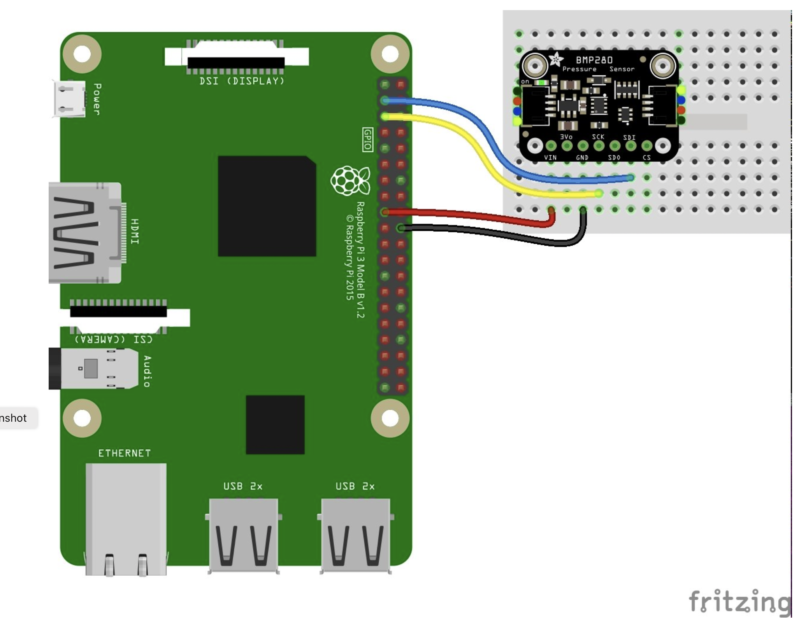
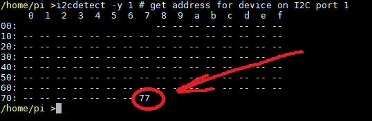

# PRG550 Lab #6

### Assigned Week of June 20, 2022

### Due July 12,13, 2022 (in-lab demonstration)

## Lab 6 Description

In Lab #6 you will install the needed libraries and tools for the class project (Assignment 2).

It will be a machine learning project to build a system that makes real-time temperature predictions by collecting historical data, building a model, building a circuit for data capture, and writing Python code with your Raspberry Pi.

You will be connecting the [Adafruit BMP280 Barometric Pressure & Altitude Sensor](https://learn.adafruit.com/adafruit-bmp280-barometric-pressure-plus-temperature-sensor-breakout) to the Raspberry Pi in order to collect real-time temperature and pressure readings.

This lab will guide you through steps needed to setup your Raspberry Pi to interface with the BMP280 and build the circuit below. 

<p align="center">

</p>

You will need:
1. Raspberry Pi that has been configured with PRG550 course requirements
1. Breadboarding kit
1. BMP280 module

## Lab 6 Demonstration Requirements

During the Lab 6 Session on campus, you will be required to successfully show:
1. real-time data collection from the BMP280 using the provided demo program
2. write a program that saves 100 data poins for temperature, pressure, altitude to a file called `BMP280_data_collection_YYYYmmdd-HHMMSS.csv` where 
    * `YYYYmmdd` is the date you are running the program and 
    * `HH:MM:SS` is the time your program was started.  
    * For example: if the program was started at 3:42:58pm on 05-Jul-2022, the file name should be: `BMP280_data_collection_20220705-154258.csv`
    
    The data in the csv file should be comma separated.  For example:

        ```
        22.3,1002.3,4101.9667
        ...
        22.1,1002.6,4101.8542
        ```

### Connecting the BMP260 sensor to the Raspberry Pi via I2C [^1]

1. Install [Adafruit Python libraries](https://pypi.org/project/adafruit-circuitpython-bmp280/) to interface with the BMP280

    ```
    # will also install the needed `board` module as a dependency
    pip3 install --upgrade adafruit-python-shell

    # install bmp280 module
    pip3 install adafruit-circuitpython-bmp280
    ```

1. Enable I2C interface:
    1. run `sudo raspi-config`
        1. --> Interface Options --> I2C --> "Would you like the ARM I2C interface to be enabled?"
        
            Answer "Yes"
        1. Exit `raspi-config`

1. Validate I2C interface is functional from command line:

    ```
    # show active I2C ports
    i2cdetect -l 
    ```

    Your output should look similar to
    ```
    /home/pi >i2cdetect -l
    i2c-1   i2c             bcm2835 (i2c@7e804000)                  I2C adapter
    i2c-2   i2c             bcm2835 (i2c@7e805000)                  I2C adapter
    ```

1. Connect the BMP280 according to wiring diagram above and validate connection by running `i2cdetect` tool.   
    ```    
    # get address for device on I2C port 1
    i2cdetect -y 1 # get address for device on I2C port 1
    ```
    Your result should be similar to below.  Make note of your BMP280's address.
    

1. Update the course repository on your Pi 
[Updating local course repository from GitHub](../references/Tips_and_Tricks.md)
    ```
    cd /home/pi/seneca-prg550-2022-spring
    git pull
    ```
1. Copy BMP280 test file to your working directory
    ```
    mkdir /home/pi/workspace/project
    cp /home/pi/seneca-prg550-2022-spring/project/bmp280_test.py /home/pi/workspace/project/
    ```
1. Run the test file to verify your BMP280 is capturing data.  Your output should be similar to below.  Use `ctrl-c` to stop the program
    ```
    cd /home/pi/workspace/project
    python3 bmp280_test.py
    ```
    Program Output
    ```
    /home/pi/workspace/project >python3 bmp280_test.py

    Temperature: 29.3961 C
    Pressure: 987.4638 hPa
    Altitude = 78.9667 meters

    Temperature: 29.3910 C
    Pressure: 987.4677 hPa
    Altitude = 78.4086 meters
    ```

1. Begin work on [Step 2 of lab demonstration](#Lab-6-Demonstration-Requirements) by copying the skeleton code file `bmp280_capture_data_to_file.py` to your working directory.  Start coding :)
    ```
    cp /home/pi/seneca-prg550-2022-spring/project/bmp280_capture_data_to_file.py /home/pi/workspace/project/
    ```


[^1]: https://learn.adafruit.com/assets/93031
