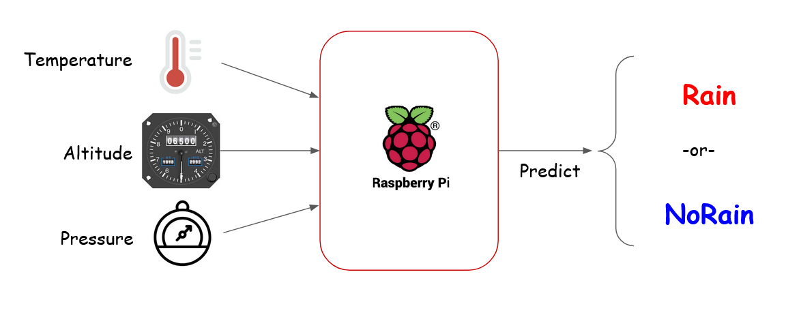

# PRG550 Lab #7

### Assigned Week of July 25, 2022

### Due August 2,3, 2022 (in-lab demonstration)

## Lab 7 Description

In this lab, you will perform the first three stages of the data science process needed before training a model to predict if there will be `Rain` or `NoRain`.  Note the labelling has been revised from 
[Lecture 7 - Capstone Project](../lectures/lecture07.md#PRG550-CapstoneProject)

1. Data Collection
1. Data Cleaning
1. Data Exploration

<p align="center">

</p>


You will used the prepared [Lab 7 Jupyter notebook](Lab07-Jupyter-Weather-Data-Collection-Clean-Explore.ipynb) code below to download hourly data for 1 month from Environment Canada's [historical data site](https://climate.weather.gc.ca/historical_data/search_historic_data_e.html).  The year, month, and day are configuration parameters to Environment Canada's download API (Application Interface)

1. Ensure you read and understand the provided code, comments, and documentation in pre-populated cells

1. Provided needed code to complete the lab and 

1. Answer questions provided in the notebook

You will need:
1. Raspberry Pi that has been configured with PRG550 course requirements

1. Ensure you're working with the [latest version of course repository](../references/Tips_and_Tricks.md#updating-local-course-repository-from-github)
1. Copy [Lab 7 Jupyter notebook](Lab07-Jupyter-Weather-Data-Collection-Clean-Explore.ipynb) to `workspace\labs` folder
    ```    
        cp /home/pi/seneca-prg550-2022-spring/labs/Lab07-Jupyter-Weather-Data-Collection-Clean-Explore.ipynb /home/pi/workspace/labs
    ```
1. Start Jupyter notebook server on the Pi and connect to it from your PC


## Lab 7 Demonstration Requirements

1. Before attending the Lab 7 Session on campus, you will 

    1. complete the coding requirements
    1. answer questions in the Lab 7 Jupyter notebook

2. During the Lab 6 Session on campus, you will be required to successfully show:

    1. successful execution of all cells within the Lab 7 Jupyter notebook
    1. correct answers to questions in the notebook
    1. be able to answer additional questions during the lab demonstration

