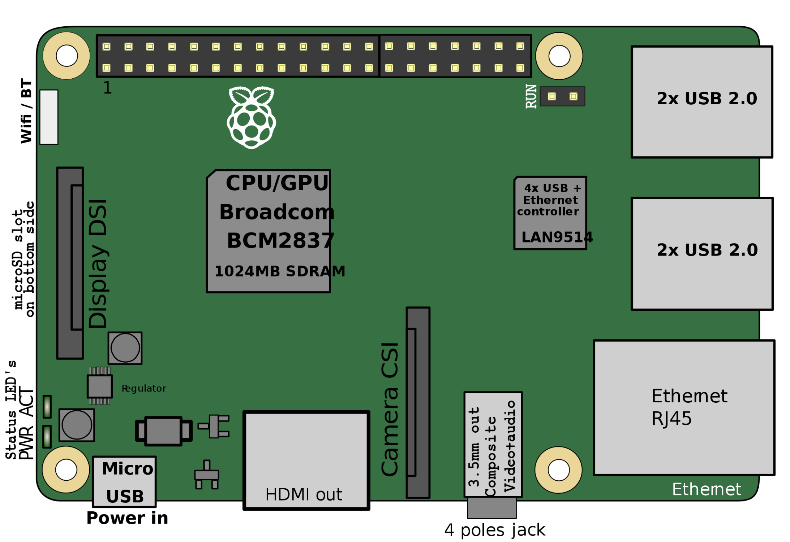
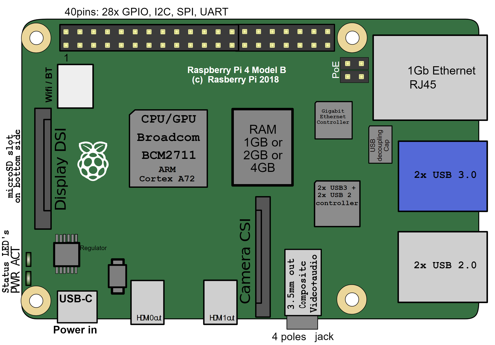
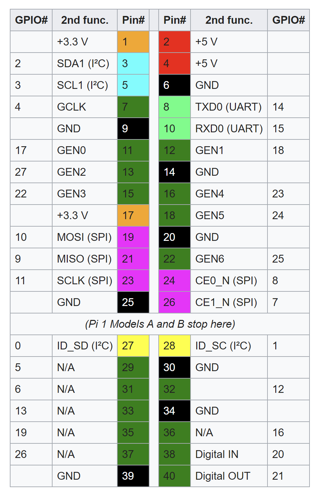
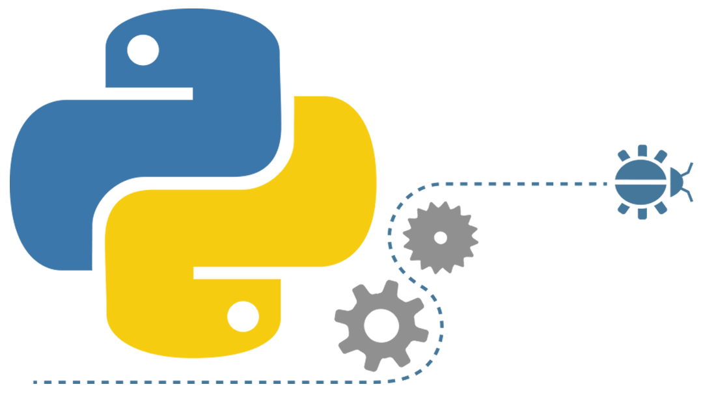
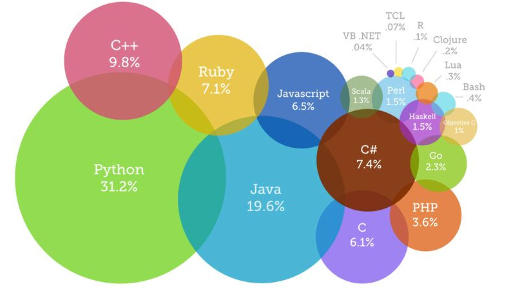
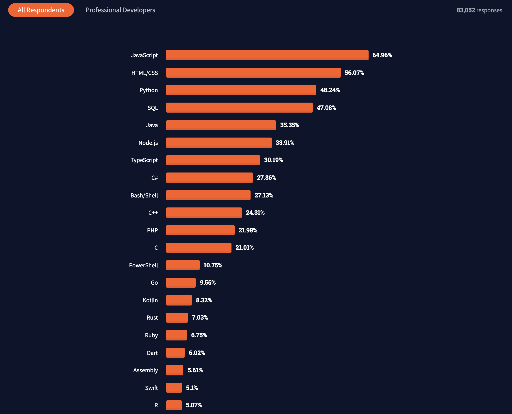

# PRG550 Lecture #0
Monday May 9, 2022

## Lecture Objectives

- this lecture will provide a review of the Raspberry Pi
- give the student motivation for learning Python
- review instructions to prepare your PC and the Raspberry Pi to complete course requirements

## Page Contents

- [The Raspberry Pi Single Board Computer](#the-raspberry-pi-single-board-computer)
- [The Python Programming Language](#the-python-programming-language)
- [Why Python?](#why-python)
- [Setup your Raspberry Pi](#setup-your-raspberry-py)
- [Creating and running your first Python program](#creating-and-running-your-first-python-program)


----------------------------------

# The Raspberry Pi Single Board Computer
The Raspberry Pi is a series of small single-board computers developed in the
United Kingdom by the Raspberry Pi Foundation to promote teaching of basic computer
science in schools and in developing countries.
According to the Raspberry Pi Foundation, as of March 2021, sales of Raspberry Pi units
have reached 38 million worldwide.

The Raspberry Pi 3 Model B was released in February 2016 with a 1.2 GHz 64-bit
quad core processor, on-board 802.11n Wi-Fi, Bluetooth and USB boot capabilities.
On Pi Day 2018 the Raspberry Pi 3 Model  B+ was launched with a faster 1.4 GHz processor
and a three-times faster gigabit Ethernet (throughput limited to ca. 300 Mbit/s by the
internal USB 2.0 connection) or 2.4 / 5 GHz dual-band 802.11ac Wi-Fi (100 Mbit/s).
Other features are Power over Ethernet (PoE) (with the add-on PoE HAT), USB boot and
network boot (an SD card is no longer required).
The Raspberry Pi 3 has 1 GB of RAM in the B and B+ models, and 512 MB of RAM in the A+ model.

<h3>Raspberry Pi 3/3B+ Schematic</h3><a href="pi3Ports.png" target="_blank"></a>

The Raspberry Pi 4 Model B was released in June 2019 with a 1.5 GHz 64-bit quad core
ARM Cortex-A72 processor, on-board 802.11ac Wi-Fi, Bluetooth 5, full gigabit Ethernet
(throughput not limited), two USB 2.0 ports, two USB 3.0 ports, and dual monitor support
(4K resolution). The Pi 4 is also powered via a USB-C port, enabling additional power to
be provided to downstream peripherals, when used with an appropriate PSU.
The Raspberry Pi 4 has a design flaw where third-party e-marked USB cables, such as
those used on Apple MacBooks, incorrectly identify it and refuse to provide power.
This is expected to be corrected in a future board revision.
Tom's Hardware tested 14 different cables and found that 11 of them turned on and powered
the Pi without issue.
The Raspberry Pi 4 has a choice of 1, 2 or 4 GB of RAM, set at time of manufacture.

<h3>Raspberry Pi 4 Schematic</h3><a href="pi4Ports.png" target="_blank"></a>

<h3>General purpose input-output (GPIO) connector</h3>Raspberry Pi 1 Models A+ and B+, Pi 2 Model B, Pi 3 Models  A+, B and B+, Pi 4,
and Pi Zero, Zero W, and Zero WH GPIO J8 have a 40-pin pinout.

<a href="piPinouts.png" target="_blank"></a>  <a href="gpio.png" target="_blank"></a>

<h3>Operating Systems</h3>The Raspberry Pi Foundation provides Raspbian, a Debian-based Linux distribution for
download, as well as third-party Ubuntu, Windows 10 IoT Core, RISC OS, and specialised
media centre distributions. It promotes Python and Scratch as the main programming
languages, with support for many other languages.
Many other operating systems can also run on the Raspberry Pi, including the formally
verified microkernel and other third-party operating systems available via the official
website include Ubuntu MATE, Windows 10 IoT Core, RISC OS and specialised distributions
for the Kodi media centre and classroom management.

<a href="https://www.raspberrypi.org/downloads/raspbian/" target="_blank">Raspbian Downloads</a>

# The Python Programming Language
The Python programming language was created by Guido van Rossum and
released in 1991. Python is an interpreted, high-level programming language
designed for general-purpose programming. Python has a design philosophy
that emphasizes code readability, and a syntax that allows programmers
to express concepts using minimal lines of code.
Python provides constructs that enable clear programming on both small
and large scales.
Python features a dynamic type system and automatic memory management,
and has a large and comprehensive standard library.
Python is a dynamic, interpreted (bytecode-compiled) language.
There are no type declarations of variables, parameters, functions, or methods
when writing source code. This makes the writing of Python code short and flexible.



In fact, according to users on StackOverflow, Python was named the fastest
growing programming language of 2017 and 2018. This was attributed to its ties to
machine learning and data science, as well as the fact that Python has become a
go-to language for analyzing data, and as a first programming language, it's
simple and straightforward (see image below).




In addition, as of 2021 using StackOverflow's survey of developers, Python
still remains a top 3 programming langauges used around the world!



And hakr.io lists Python as the best programming language to learn first.
<a href="https://hackr.io/blog/best-programming-languages-to-learn-2021-jobs-future" target="_blank">https://hackr.io/blog/best-programming-languages-to-learn-2021-jobs-future</a>

Also, as of July 2021, Python is currently the most popular language for
teaching introductory computer science courses at top-ranked U.S. departments.
Specifically, eight of the top 10 CS departments (80%), and 27 of the top
39 (69%), teach Python in introductory CS0 or CS1 courses (see image below).


Advantages of using Python
1. Python is multi-platorm (is available for Windows, Mac OS X, Linux, Raspberry Pi (ARM)).
2. Python is open source and freely available for download,
   modification, and updating (adding functionality).
3. Python has powerful string and text processing capabilities
   as well as a powerful regular expression engine.
4. Python is heavily modularized (i.e. contains thousands of modules/packages
   that allow for increased functionality and can be incorporated into
   any program using the import directive.
   Modules are available on PyPi (<a href="https://pypi.python.org/pypi" target="_blank">https://pypi.python.org/pypi</a>)
   As of this writing, there are 326,059 packages available for download.
5. Allows for high level data structures (lists, dictionaries, etc.) that
   are easy to learn, use, and allows for writing powerful applications
   with relatively few lines of code.
6. Can be written procedurally or using Object-Oriented constructs.
7. Allows for simple Rapid Application Development (RAD).

[Python 3 References](../README.md#references)
- [official documentation](https://docs.python.org/3/)
- [tutorial](https://www.w3schools.com/python/default.asp)

# Why Python?

- Data science with Python
    - [handbook](https://jakevdp.github.io/PythonDataScienceHandbook/)
    - [pandas](https://pandas.pydata.org/docs/user_guide/index.html)
    - [numpy](https://numpy.org/doc/stable/user/quickstart.html)
- Gateway to Machine learning 
    - [scikit-learn](https://scikit-learn.org/stable/)
    - [tensorflow](https://www.tensorflow.org/resources/learn-ml)
    - [pytorch](https://pytorch.org/tutorials/beginner/pytorch_with_examples.html)
- [Python Zen](https://peps.python.org/pep-0020/)

# Setup your Raspberry Pi

Follow [set up tooling](../setup/README.md) references to configure and install tools for your Raspberry Pi

# Creating and running your first Python program

(Assume platform=Raspberry Pi and working directory is `/home/pi/workspace`)
```
#!/home/pi/workspace
import platform
print("Welcome to PRG550 and Hello Python World!\n")
print("You're using Python version {0}".format(platform.python_version()) )
```


