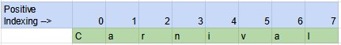
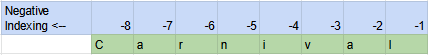
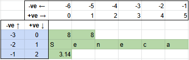
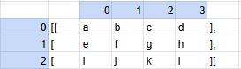

# PRG550 Lecture #2
Monday May 16, 2022

## Lecture Objective

- Gain understanding of Python lists and dictionary/associative arrays, how they operate, their properties and built-in methods
- Understand when Python lists and dictionary/associative arrays should be used

## Pre-requisites

- Python version 3.9.9 installed on your computer and on Raspberry Pi
    check Python version with `python -V`

## Page Contents
- [Python Lists and List functions](#Python-Lists-and-List-functions)
    - [Accessing elements from a list](#Accessing-elements-from-a-list)
    - [Python List Methods](#Python-List-Methods)
    - [Python Comprehensions](#Python-Comprehensions)
    - [Python List Membership Tests](#Python-List-Membership-Tests)
    - [Iterating through a List in Python](#Iterating-through-a-List-in-Python)
    - [Python Built In List functions](#Python-Built-In-List-functions)
- [Python Dictionaries / Associative Arrays](#Python-Dictionaries-/-Associative-Arrays)
    - [Accessing elements from a Python dictionary](#Accessing-elements-from-a-Python-dictionary)
    - [Python Dictionary Methods](#Python-Dictionary-Methods)
    - [Python dictionary membership test](#Python-dictionary-membership-test)
    - [Iterating through items of a Python dictionary](#Iterating-through-items-of-a-Python-dictionary)
    - [Python built-in dictionary functions](#Python-built-in-dictionary-functions)
- [Class Exercise A](#Class-Exercise-A)
- [Class Exercise B](#Class-Exercise-B)
- [Class Exercise C](#Class-Exercise-C)
- [Class Exercise D](#Class-Exercise-D)

----------------------------------

There are four collection data types in the Python programming language:

1. _List_ is a collection which is ordered and changeable. Allows duplicate members.
1. _Dictionary_ is a collection which is ordered[^0] and changeable. No duplicate members.
1. _Tuple_ is a collection which is ordered and unchangeable. Allows duplicate members.
1. _Set_ is a collection which is unordered, unchangeable[^1] and unindexed. No duplicate members.

[^0]: As of Python version 3.7, dictionaries are ordered. In Python 3.6 and earlier, dictionaries are unordered.

[^1]: Set items are unchangeable, but you can remove and/or add items whenever you like.


## Python Lists and List functions

The Python programming language offers a range of compound datatypes
referred to as sequences. The List is one of the most frequently used
and very versatile datatype used in Python.
- A Python list is created by placing all of the items (elements) inside
square brackets `[]`, separated by commas.
- A Python list may contain any number of items and the elements may
consist of different types (integer, float, string etc.).
- Note that Python does not have built-in support for arrays, the list collection can be used instead
Examples:

```
items_one = [] # empty list
```
```
nums_list = [1, 99, -7, 18] # list of integers
```

### Accessing elements from a list

There are various ways to access list elements in Python.
The index operator `[]` can be used to access an item in a list.
Indexes start at 0, thus, a list having 5 elements will have indexes
ranging from 0 to 4.
Examples:
```
print(mixed_list[0]) # displays: 88
```
In Python, list (or array) indexing can be referenced from the beginning or the end
```
string1 = 'Carnival
```
This diagram shows indexing relative to the beginning of the list (postive indexing) to refer to each character in `string1`



This diagram shows indexing relative to the end of the list (negative indexing) to refer to each character in `string1`



### Python list slicing
List slicing is used to access portions of a list.  Multiple elements can also be accessed by using the range `:` operator.  The syntax for slicing is
```
my_list[index_start:index_stop:index_step]
```  
Similar to the `range()` function, Python uses `<` when evaluating `index_stop`.  Furthermore `index_step != 0`
For example:
```
mixed_list = [88, "Seneca", 3.14] # list with mixed data types
```


```
print(mixed_list[1:]) # displays: Seneca 3.14
```
```
print(mixed_list[-1]) # displays: 3.14
```

Trying to access an element that does not exist raises an `IndexError`,
and the index must be an integer. Using another index type (i.e.)
float or string will result in a `TypeError`.

In addition, lists in Python may contain other lists as items and are
referred to as nested lists.

Nested list example:
```
nested_list = [ 19, "python", [1, 1, 2, 3], ['a', 'b', 'c']]
```
```
# displays: 19, 'h', 2, 'b'
print(nested_list[0], nested_list[1][3], nested_list[2][2], nested_list[3][1])
```

The item at index 1 of `nested_list` can be viewed as:
```
                     0  1  2  3  4  5
nested_list[1] =    +--+--+--+--+--+--+
                    |p |y |t |h |o |n |
                    +--+--+--+--+--+--+
                    -6 -5 -4 -3 -2 -1
print(nested_list[1][2:5]) # displays "tho"
```

Individual items can be added to python lists by using the `append()`
method and several items can be added by using the `extend()` method.
For example:
```
odd = [1, 3, 5, 7, 9]
```
```
odd.append(11)
print(odd) # displays: [1, 3, 5, 7, 9, 11]
```
```
odd.extend([27, 29, 31])
print(odd) # displays: [1, 3, 5, 7, 9, 11, 27, 29, 31]
```

The `+` operator can also be used to combine two lists and is
referred to as a list concatenation.

The `*` operator can be used to repeat a list n number of
times.
For example:
```
even = [2, 4, 6]
even = even + [8, 10, 12]
print(even) # displays: [2, 4, 6, 8, 10, 12]
```
```
print(even[2:4] * 5) # displays: [6, 8, 6, 8, 6, 8, 6, 8, 6, 8]
```

Also, the `insert()` method can be used to insert one or more items
starting at a specific index into a Python list.
For example:
```
strings = ["Python", "wonderful", "language"]
strings.insert(1, ["is", "a"])
strings.insert(4, "!")
print(strings) # displays:  ['Python', ['is', 'a'], 'wonderful', 'language', '!']
```

One or more items in a list (or the entire list) can be deleted by using
the `del` keyword.
Examples:
```
del strings[2]
print(strings) # displays:  ['Python', ['is', 'a'], 'language', '!']
```

The `remove()` method can be used to remove a specific item by value
and the `pop()` method can be used to remove an item at specific index.
When using the `pop()` method, if an index is not provided, `pop()`
removes and returns the last item in the list.
This allows Python to implement lists as stacks (first-in-last-out
data structure).
In addition, the `clear()` method can also be used to create an empty list.
Examples:

```
quote = ["she", "sells", "sea", "shells", "by", "the", "polluted", "seashore", "?"]
quote.remove("polluted")
item = quote.pop()
print(quote) # displays: ["she", "sells", "sea", "shells", "by", "the", seashore"]
```

```
print("items in list:", len(quote), "popped item is:", item) # displays: items in list: 7 popped item is: ?
```
```
quote.clear()
print(quote) # displays: []
```

One last method used to remove items from a list is to assign one or more
items the empty list `[]`

```
quote = ["she", "sells", "sea", "shells", "by", "the", "polluted", "seashore", "?", "***"]
quote[6] = []
quote[8:10] = []
```

```
print(quote) # displays: ['she', 'sells', 'sea', 'shells', 'by', 'the', [], 'seashore']
print("items in list:", len(quote))
```

### Python List Methods

|    |                |
|----|:----------------|
|`append()` |  Add an element to the end of the list |
|`extend()` |  Add all elements of a list to the another list |
|`insert()` |  Insert an item at the defined index |
|`remove()` |  Removes an item from the list |
|`pop()` |     Removes and returns an element at the given index |
|`clear()` |   Removes all items from the list |
|`index()` |   Returns the index of the first matched item |
|`count()` |   Returns the returns the number of elements with the specified value |
|`sort()` |    Sort items in a list in ascending order |
|`reverse()` | Reverse the order of items in the list |
|`copy()` |    Returns a shallow copy of the list |


### Python List Membership Tests
Python allows testing if an item exists in a list or not, by using
the keyword 'in'.
```
odd_numbers = [x for x in range(20) if x % 2 == 1]
print(5 in odd_numbers) # displays: True
```
```
print(6 in odd_numbers) # displays: False
```
```
print(98 not in odd_numbers) # displays: True
```
Another way to create odd numbers:
```
numbers = [x for x in range(20)]
odd_numbers = numbers[1:20:2]
even_numbers = numbers[?:?:?] # how?
```


### Python Comprehensions
Python comprehensions are an elegant and concise way to create new lists or dictionaries
from existing lists/dictionaries or natively in Python.
- List comprehensions consists of an expression followed by a `for`
statement inside square brackets `[]`.
- Dictionary ([below](#Python-Dictionaries-/-Associative-Arrays)) comprehensions consists of an expression followed by a `for`
statement inside braces `{}`.

The example below is used to create a list with each item in the list
being increased by a power of 2
```
powers_of_two = [2 ** x for x in range(10)]
print(powers_of_two) # displays: [1, 2, 4, 8, 16, 32, 64, 128, 256, 512]
```

NOTE: The code above is equivalent to:
```
powers_of_two = [ ]
for x in range(10) :
   powers_of_two.append(2 ** x)
print(powers_of_two)
```

List comprehensions can optionally contain additional `for` or `if` statements.
An optional `if` statement can be used to filter out items when creating
the new list.  
For example:
```
powers_of_two_more_than_five = [2 ** x for x in range(10) if x > 5]
print(powers_of_two_more_than_five) # displays: [64, 128, 256, 512]
```

```
odd_numbers = [x for x in range(20) if x % 2 == 1]
print(odd_numbers) # displays: [1, 3, 5, 7, 9, 11, 13, 15, 17, 19]
```
With nested statements, the _outermost_ statement is on the left (ie helpful to read code from right-to-left)
```
nested_comprehension = [x + y for x in ['Python ','C '] for y in ['Language', 'Programming']]
print(nested_comprehension) # displays: ['Python Language', 'Python Programming', 'C Language', 'C Programming']
```
Alternate code to the above:
```
output = []
for x in ['Python ','C ']:
    for y in ['Language', 'Programming']:
        output.append(x+y)
```
What will these statements return?  Why?
```
output==nested_comprehension
output[0]==nested_comprehension[0]
```

#### Indexing into a 2-dimensional array
By convention with 2d arrays, the first index refers to the row, the second index refers to the column



What indexing would you use to access `e`, `d`, `j` ?
```
letters = [['a', 'b', 'c', 'd'], ['e','f','g','h'], ['i','j','k','l']]
```

#### Creating dynamic multi-dimensional lists in Python using list comprehensions
```
# creates a list containing 5 lists, each of 8 items, all set to 0
rows,cols = 5,8
#           minor axis loop (cols)  major axis loop (rows)
#                     ||                     ||
array2d = [[0 for j in range(cols)] for i in range(rows)]
print(array2d)
```

Creating a 3-dimensional array
```
# creates a list containing 2 pages, each page with 5 lists, each list with 8 items, all set to 0
pages,rows,cols=2,5,3
#            minor axis-2 loop       minor axis-1 loop     major axis loop
#                    ||                      ||                    ||
array3d = [[[0 for k in range(cols)] for j in range(rows)] for i in range(pages)]
print(array3d)
```

### Iterating through a List in Python
Any loop can be used to iterate through a list, but a `for` loop is
an intuitive way to iterate though each item in a list.
```
fruits = ['apple', 'banana', 'mango', 'orange', 'kiwi', 'peach', 'strawberry']
for item in fruits:
   print("I like", item + "s")
```

Another readable alternative
```
for item in fruits:
   print("I like {0}s".format(item)) 
```
```
# displays:
# I like apples
# I like bananas
# I like mangos
# I like oranges
# I like kiwis
# I like peachs
# I like strawberrys
```

### Python Built In List functions
|    |                |
|----|:----------------|
|all() | Returns `True` if all elements of the list are true (or if the list is empty). |
|any() | Returns `True` if any element of the list is true. If the list is empty, return  |`False`. |
|enumerate() | Returns an enumerate object containing the index and value of all the items of list as a tuple. |
|len() | Returns the length (the number of items) in the list. |
|list() | Convert an iterable (tuple, string, set, dictionary) to a list. |
|max() | Returns the largest item in the list. |
|min() | Returns the smallest item in the list |
|sorted() | Returns a new sorted list (does not sort the list itself). |
|sum() | Returns the sum of all elements in the list. |


## Python Dictionaries / Associative Arrays

In Python, a dictionary is an unordered collection of items consisting
of key / value pairs.
- Dictionaries are optimized to retrieve values when the key is known.
- Creating a dictionary in Python is accomplished by writing a series of
comma separated key / value pairs (each separated by the colon `:`
character, within curly braces `{}`.
- The first item is the key with its corresponding second item being
the value expressed as a pair (i.e. key : value).
- While values can be of any data type and can repeat, keys must be of
an immutable type (string, number or tuple with immutable elements)
and all keys must be unique.
- Python dictionaries may also be created with the `dict()` function.

Python dictionary examples:
```
sample_dictionary = {} # empty dictionary
```
Dictionary with string keys:
```
airport_codes = { "yyz" : "toronto", "nrt" : "tokyo", "jfk" : "new york",
                 "cdg" : "paris", "sfo" : "san francisco" }
```
IATA airport codes [^2]

Dictionary with integer keys:
```
int_dictionary = { 16 : 'item 16', 37 : 'item 37' }
```
Dictionary with mixed keys:
```
mixed_dictionary = { 'name' : 'Sally',  2 : [3, 6, 9] }
```
Creating dictionaries using built-in `dict()` function:
```
courses = dict({ 'prg155' : 'C Programmming', 'prg550' : 'Python Programming' })
```
Creating dictionaries using built-in `zip()` function:
```
iata_identifier = ["yyz", "nrt", "jfk", "cdg", "sfo"]
city = ["toronto", "tokyo","new york", "paris","san francisco"]

airport_codes = dict(zip(iata_identifier, city))
```
What's the output from this code?  Why?
```
iata_identifier = ["yyz", "nrt", "jfk", "cdg"]
city = ["toronto", "tokyo","new york", "paris","san francisco"]
airport_codes = dict(zip(iata_identifier, city))
```

Creating dictionaries with default values:
```
my_keys = ['w', 'x', 'y', 'z']
default_value = None

dictionary_with_default = dict.fromkeys(my_keys, default_value)
```

[^2]: [international airport code](https://en.wikipedia.org/wiki/IATA_airport_code)

### Accessing elements from a Python dictionary
- Unlike lists, tuples, or arrays (which use indexing), iterating through a
a dictionary in Python requires using each dictionary's keys.
- Accessing elements is achieved by using either square brackets or with
the `get()` method.
- The difference in using `get()` is that it returns None instead of KeyError,
if the key cannot be found within the dictionary.
Example:
```
print(airport_codes)             # displays all key / value pairs
print(airport_codes["yyz"])      # displays toronto
print(airport_codes.get("sfo"))  # displays san francisco
print(airport_codes["yyj"])      # generates a KeyError exception
print(airport_codes.get("yyj"))  # displays None
```

In Python, dictionaries are mutable, so that new items can be added or
changed using the assignment operator.

If the key is already present, the value gets updated, otherwise a new
key : value pair is added to the dictionary.
```
airport_codes["yyj"] = "vancouver" # adding (yyj : vancouver) to dictionary
```

To delete or remove a specific item from a dictionary, the `pop()` method
may be used. `pop()` removes the item with the provided key and returns
the value.
```
city = airport_codes.pop('cdg')
print(city)          # displays: paris
print(airport_codes)  # cdg : paris no longer in the dictionary
```
In addition, the `popitem()` method can be used to remove and return an
arbitrary item (key : value) from the dictionary.

Also, all dictionary items can be removed using the `clear()` method.
```
rand_city = airport_codes.popitem()
print(rand_city)
airport_codes.clear()
print(airport_codes)
```

### Python Dictionary Methods
The table below, lists methods that are available to be used with
with Python dictionaries.
|    |                 |
|----|:----------------|
|clear()              |Remove all items form the dictionary.|
|copy()               |Return a shallow copy of the dictionary.|
|fromkeys(seq[, v])    |Return a new dictionary with keys from seq and all values equal to `v` (defaults to `None`).|
|get(key[, d])         |Return the value of `key`. If `key` does not exist, return `d` (defaults to `None`).|
|items()              |Return a new view of the dictionary's items (key, value).|
|keys()               |Return a new view of the dictionary's keys.|
|pop(key[, d])         |Remove the item with `key` and return its value or `d` if `key` is not found. If `d` is not provided and `key` is not found, raises `KeyError`.|
|popitem()            |Remove the item that was last inserted into the dictionary. Raises `KeyError` if the dictionary is empty.|
|setdefault(key[, d])  |If `key` is in the dictionary, return its value. If not, insert `key` with a value of `d` and return `d`(defaults to `None`).|
|update([other])       |Update the dictionary with the key/value pairs from `other`, overwriting existing keys.|
|values()             |Return a new view of the dictionary's values|

Examples:
```
courses = {}.fromkeys(['programming', 'electronics', 'math'], 99.9)
print(courses) # displays: {'programming': 99.9, 'electronics': 99.9, 'math': 99.9}
```
```
print(sorted(courses.keys())) # displays: ['electronics', 'math', 'programming']
```
```
airport_codes.setdefault("syd", "sydney") # adds syd : sydney to airport_codes dictionary
print(airport_codes)
```

### Python dictionary membership test
As with lists, to test if a key is in a dictionary or not, the keyword in
may be used. Note, the membership test can be used with keys only, not values.
```
print("yyz" in airport_codes)     # displays: True
```
```
print("zrh" not in airport_codes) # displays: True
```
```
print("sel" in airport_codes)     # displays: False
```


### Iterating through items of a Python dictionary
Iterating through a Python dictionary can be achieved by using a for loop:
```
for k in airport_codes :
   print(k) # print the value of key `k`
```
```
for k in airport_codes :
   print(airport_codes[k]) # print the value for key `k`
```
```
for (k,v) in airport_codes.items():
    print("IATA code is {0} for city of {1}".format(k, v))
```

### Python built-in Dictionary Functions
|    |                 |
|----|:----------------|
|all()     |Return True if all keys of the dictionary are true (or if the dictionary is empty).|
|any()     |Return True if any key of the dictionary is true, and if the dictionary is empty, return False.|
|len()     |Return the length (the number of items) in the dictionary.|
|cmp()     |Compares items of two dictionaries.|
|sorted()  |Return a new sorted list of keys in the dictionary.|


## Class Exercise A

Write a Python program to remove ALL duplicates from a list.  Find the list item that has the highest frequency
For example, the list   `[2, 3, 10, 10, 8, 9, 2, 8, 16, 3, 2, 3]`
would result in a list: `[2, 3, 10, 8, 9, 16]`


## Class Exercise B

Given the following three 3 x 3 matrices (2-dimensional lists):
```
x1 = [[12, 7, 3],
     [4, 5, 6],
     [7, 8, 9]]

y1 = [[5, 8, 1],
     [6, 7, 3],
     [4, 5, 9]]

z1 = [[0, 0, 0],
     [0, 0, 0],
     [0, 0, 0]]
```

Write the Python code that loops through the matrices and adds all
of the elements in `x1` to the corresponding elements in `y1` and stores
the result in `z1`.
When displaying all of the elements in `z1`, your output should be:
```
[17, 15, 4]
[10, 12, 9]
[11, 13, 18]
```
NOTE: Use nested `for` loops to complete your solution.


## Class Exercise C
In Python, a matrix can be implemented as a nested list
(a list inside a list).
For example `a1 = [[1, 2], [4, 5], [3, 6]]` would represent a 3 x 2 matrix.
First row can be selected as `a1[0]` and the element in first row,
first column can be selected as `a1[0][0]`.
Transposing of a matrix is the interchanging of rows and columns.
It is denoted as `a1'`. The element at the ith row and jth column in a1
will be placed at jth row and ith column in `a1'`.
So if a1 is a 3 x 2 matrix, `a1'` will be a 2 x 3 matrix.
Therefore, given the following matrices:
```
a1 = [[12, 7],
      [4, 5],
      [3, 8]]

t1 = [[0, 0, 0],
     [0, 0, 0]]
```
Write the Python code that will transpose matrix `a1` (3 x 2) into
matrix `t1` (2 x 3).
Your solution should yield `t1` as:
```
[12, 4, 3]
[7, 5, 8]
```


## Class Exercise D
Given a class of students and the courses they are taking this semester:
```
student_name = ['Jane', 'Hamed', 'Maryam', 'William']
courses = ['programming', 'calculus', 'physics']
```
Create a dictionary to show the courses each student is taking and their mark.  Use the `randint(45,100)` function from the `random` module[^3] to randomly assign grades between 45% to 100% for each course taken by the student
```
from random import randint
course_grade = randint(45,100) # generate random number between 45 and 100
```
Your output should be similar to below (your grades will be different)
```
class_courses_and_grades = {
    "Jane" : { "courses": {
                    "programming": 70,
                    "calculus": 80,
                    "physics": 85
                            }
            }
    },
    "Hamed" : { "courses": {
                    "programming": 72,
                    "calculus": 76,
                    "physics": 65
                            }
            }
    },
    "Maryam" : { "courses": {
                    "programming": 86,
                    "calculus": 55,
                    "physics": 67
                            }
            }
    },
    "William" : { "courses": {
                    "programming": 56,
                    "calculus": 85,
                    "physics": 68
                            }
            }
    }
}
```
[^3]: [Generate pseudo-random numbers](https://docs.python.org/3.9/library/random.html)


