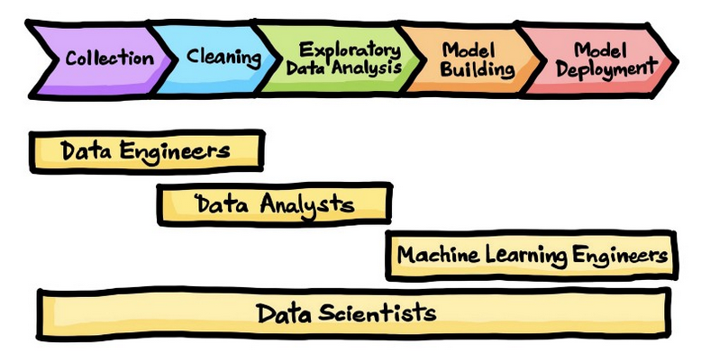
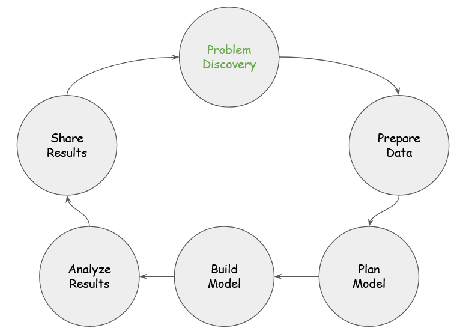
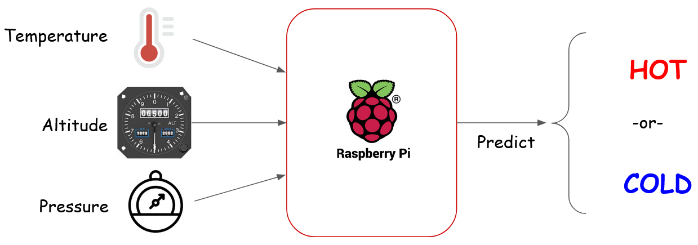

# PRG550 Lecture #7
Monday July 4, 2022

## Lecture Objective

- Introduction to Data Science and Machine Learning with the Raspberry Pi
- Assignment 2 - Introduction

## Pre-requisites

- Python version 3.9.9 installed on your computer and on Raspberry Pi
    check Python version with `python -V`

## Page Contents

- [What is Machine Learning?](#What-is-Machine-Learning?)
- [Career Roles in Data Science](#Career-Roles-in-Data-Science)
    - [Career Roles and Stages in the Data Science Process](#Career-Roles-and-Stages-in-the-Data-Science-Process)
    - [Career Profile: Data Scientist at Shopify](#Career-Profile-Data-Scientist-at-Shopify)
- [Data Science and ML](#Data-Science-and-ML)
- [A Chef's Guide to the Data Science Process](#A-Chef's-Guide-to-the-Data-Science-Process)
- [PRG550 Capstone Project](#PRG550-Capstone-Project)
    - [Data Science and Machine Learning with the Raspberry Pi](#Data-Science-and-Machine-Learning-with-the-Raspberry-Pi)
    - [Data Science Process Applied to PRG550 Capstone Project](#Data-Science-Process-Applied-to-PRG550-Capstone-Project)

----------------------------------

## What is Machine Learning? 

A couple questions to start off:

  
Q: Where would do you encounter machine learning in your day-to-day life?

- YouTube recommendations
- traffic light controls
- stock prices
- Google
- email spam
- Facebook marketing suggestions
- cell phone camera app

  
Q: How do you think machine learning works?

- You give it data and teach it what its supposed to look for in the data
- makes a guess based on previous data then gets feedback from the user
- previous usage (past data)

Machine learning is an area of study that is based on using data to perform tasks or solve problems.  A machine learning model (ML model) is built using past sample data in order to make predictions or decisions.  

Approaches to Machine learning fall into two broad categories:

1. Supervised Learning
    - You have access to past data that are labelled with characteristics that you want to predict. 
    - Supervised learning can be applied to two areas of problems:
        1. classification:  your data falls into different categories (ex: sunny, rain, windy)
        1. regression: you want to use your data to predict a numerical value (ex: tomorrow's temperatore will be 24&deg;C)

2. Unsupervised Learning
    - You have unlabelled data

## Career Roles in Data Science

Data science and machine learning offer a wide variety of career opportunities.  
Career roles in data science are largely intertwined with stages in the data life cycle:
- data collection
- data cleaning
- data exploration
- build data model
- deploy data model

We will go deeper into each of the above stages later on in the class.

Corresponding to these stages, this visualization overlays the stages of the data process with four main categories of career roles [^1].

### Career Roles and Stages in the Data Science Process

## Career Profile: Data Scientist at Shopify

- [Kamakshi Bagga](https://docs.google.com/document/d/1jl-R-YK1BnxMLtlHJFu1UDhwCx7puCqnxo_pYHpcq-M/edit)

## Data Science and ML

Data science is an iterative process involving several stages, each of which can be major sub-projects on its own.  Machine Learning (ML) is just one tool among many to help shed light into what data can reveal about the problem you're trying to solve.

It's important to keep in mind that there might not be "a right answer".  Often data science practitioners are faced with providing a *close-enough* result rather than the best result.  Similar to the stages in the data process above, the overall data science process is made up of a series of steps.  One key difference to note is its cyclical nature.  A new pass through the cycle is taken when exploring a different technique to improve the approach that was taken.

## A Chef's Guide to the Data Science Process

The table below describes what a chef using the data science process might think about when they prepare a meal.   This analogy may help you understand and remember the stages in the data science process.

|Process Step|Description|
|:-----------|:----------|
| 1. Problem statement | - decide food menu and identifying recipes to use |
| 2. Data Preparation | - get, clean, prepare raw ingredients (potatoes, onion, meat) |
| 3. Plan Model | - get needed tools together (chopping board, chopsticks, pots, blender, etc) |
| 4. Build Model | - start cooking |
| 5. Analyze Results | - taste test |
| 6. Share Results | - share food with others and ask for feedback |

## PRG550 Capstone Project
### Data Science and Machine Learning with the Raspberry Pi

In the reminder of this course, we will use foundational skills from [Lecture 1](lecture01.md)
,[Lecture 2](lecture02.md), [Lecture 3](lecture03.md), [Lecture 4](lecture04.md), [Lecture 5](lecture05.md), and [Lecture 6](lecture06.md) to build a system that makes real-time temperature predictions by collecting historical data, building a model, building a circuit for data capture, and writing Python code with your Raspberry Pi.  This diagram will be our [North Star](https://en.wikipedia.org/wiki/Polaris) to [guide us](https://hbr.org/2012/01/what-wise-leaders-always-follo) [^2][^3] to the end of the course.

### Data Science Process Applied to PRG550 Capstone Project

|Process Step|Description|
|:-----------|:----------|
| 1. Problem statement | - use Pi to predict whether it will be hot or cold in Toronto using input from BMP280 module in Python (Pandas and scikit-learn) |
| 2. Data Preparation | - acquire the right data   - data matches where you want to predict the weather (get toronto-based data)   - data cleaning and preparation (convert farenheit to celsius, fill in miss data) |
| 3. Plan Model | - Classification: provide category prediction into one of several groups  - ~~Linear Regression: provide numerical prediction of temperature (ex: 25&deg;C)~~ (won't be usiing this type of model for PRG550)|
| 4. Build Model | - use raw ingredients and build model - write code with Pandas and scikit-learn |
| 5. Analyze Results | - sanity check if results make sense to you|
| 6. Share Results | - share results with broader team to see if results meet requirements in problem statement   - ask for feedback and ideas for improvement   - iterate through cycle again if needed |

[^1]: [The Data Science Process, towardsdatascience.com](https://towardsdatascience.com/the-data-science-process-a19eb7ebc41b)

[^2]: [Polaris, Wikipedia](https://en.wikipedia.org/wiki/Polaris) 

[^3] [What Wise Leaders Always Follow, Harvard Business Review](https://hbr.org/2012/01/what-wise-leaders-always-follo) 