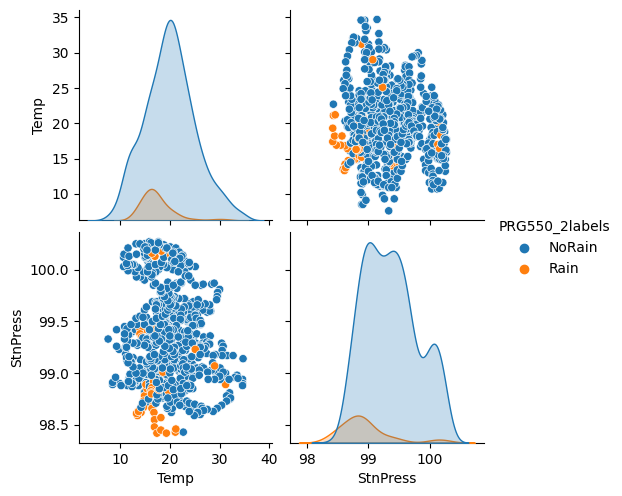
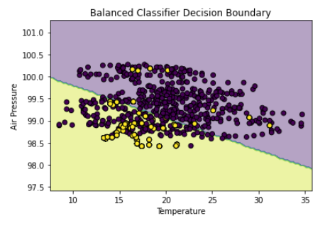
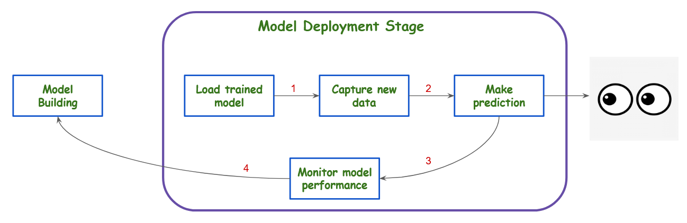

# PRG550 Lecture #9
Monday August 8, 2022

## Lecture Objective

- This lecture will provide you with an overview of the scikit-learn machine learning library in Python. You will gain an understanding and experience working with a classification model using two input features along with their labels.

## Pre-requisites

- Python version 3.9.9 installed on your computer and on Raspberry Pi
    check Python version with `python -V`

## Page Contents

- [Data Science Process](#Data-Science-Process)
    - [Model Building](#Model-Building)
        - [Training set and testing set](#Training-set-and-testing-set)
        - [The steps to building a model](#The-steps-to-building-a-model)
        - [Data Class Imbalance](#Data-Class-Imbalance)
        - [Model Decision Boundary](#Model-Decision-Boundary)
- [Model Deployment](#Model-Deployment)
- [Lecture 9 Notebook](#Lecture-9-Notebook)

----------------------------------

## Data Science Process

[^1]: [Machine learning: the problem setting](https://scikit-learn.org/stable/tutorial/basic/tutorial.html#machine-learning-the-problem-setting)

### Model Building

After our data has been cleaned and we have undergone initial data exploration to understand different fields present in the dataset, we are ready to begin the iterative process of using features in the prepared data for to build a model for prediction.

In [Lecture 7](lecture07.md) we discussed using a supervised machine learning model to predict the weather using a classifier.  This means we will need to take our cleaned data and choose data fields to use as features and target labels.  These features, along with the target label will be fed to the model for training

#### Training set and testing set

As machine learning is about learning some characteristics of a dataset and then assessing the trained model against another data set.  A common practice in machine learning is to evaluate a model by splitting a data set into two.  We call the first one the training set (used to learn properties and characteristics of the data).  The second set the called the testing set (used to test how well a model the learned the data's properties)

In the ideal case, we want a model that generalizes well so that accurate predications can be made when it sees new data that's outside of training and test datasets.  
Good accuracy on the test data means the model generalized well (ie it is able to make good predictions on data it has never seen before).

In the case of a classifier, one way to measure its performance is to compare predictions with known correct labels.  The number of correctly labelled predictions vs number of total predictions is called accuracy.  Accuracy is measured using training data as well as test data and a higher values means the model is more likely to produce correct predictions.

#### Data Class Imbalance

When performing classification, one data characteristic to be aware of is whether the data is balanced.  When training a model with unbalanced data, the model is very likely to learn incorrectly and will not be accurate for non-training data.

In the case of Rain/NoRain classification with Environment Canada data (figure below), the number of hourly datapoints having rain is quite low.  There are very few orange dots (59) vs blue dots (661).  Here, *NoRain* is called the majority class and *Rain* is called the minority class.

A naive classifier that always predicts NoRain will be accurate 91.8% of the time! (661/(661+59)).  Clearly this is not what we want for a trained model.  In [Assignment 2 Notebook](Assignment2.ipynb), a very simple way to overcome this is by increasing the minority class by upsampling (basically creating duplicates of rows having *NoRain* until it also as 661 entries).  By using upsampling, the model's training accuracy drops from 91.5% to 75.5% and results in a model that will perform better with live data.

#### Model Decision Boundary

When building a classification model, sometimes it is helpful to visualize how the model determines what class to assign a data point.  A decision boundary diagram can shed light into what the model is doing.  The graph below shows the decision boundary for the Environment Canada dataset for *Rain/NoRain* classification.  If a data point falls into the light purple area, it will be classified as *NoRain*, if it falls into the yellow area, it will be classified as *Rain*.  With a two-feature `LogisticRegression` classifier, the decision boundary is a straight line.  When the model trains, it is basically looking for the best line to separate the bright yellow and dark purple dots.

#### The steps to building a model

1. Separate data into train and test datasets
1. Train model using train data
1. Evaluate model using test data
1. Store trained model for future use

### Model Deployment

To deploy a trained model to make predictions, you will typically load a pre-trained model and supply the model with new (or live) data.  The figure below illustrates how model deployment is connected with model building stages in the data science process.  The *Model Deployment* stage takes in a trained model produced by the *Model Building* stage.  New data is fed into the model and a prediction is made for a downstream application.

As we shall see at the end of the [Lecture 9 Jupyter Notebook](Lecture09-Jupyter-Notes.ipynb), it's important to ensure that the new data does not change dramatically from the training data that the model was trained on.  Otherwise, you may be in danger of producing bad results for your users.  

To reduce the risk of this happening, a model performance monitoring step is added compare the distribution profile of new data vs data used to train the model.

In the event that new data becomes very different from training data, feedback is given to the Model Building stage (#4) (remember how data science is a cycle!).  When this happens, the data scientist will take steps to update the model.

### Lecture 9 Notebook

The [Lecture 9 Jupyter Notebook](Lecture09-Jupyter-Notes.ipynb) demonstrates model building and deployment in detail using  synthetic data.  Artificial (synthetic) datasets will be used to give you experience changing the input data and seeing how it will impact the effectiveness of the classifcation model.  

The advantage of synthetic data is that you will have control over its quantity and characteristics and allow you to focus only on understanding the model itself.  Once you have a good handle on the model, you can substitute real data as the next step ([Assignment 2](../project/assignment02.md) asks you to do the same thing, but with real data from Environment Canada)

