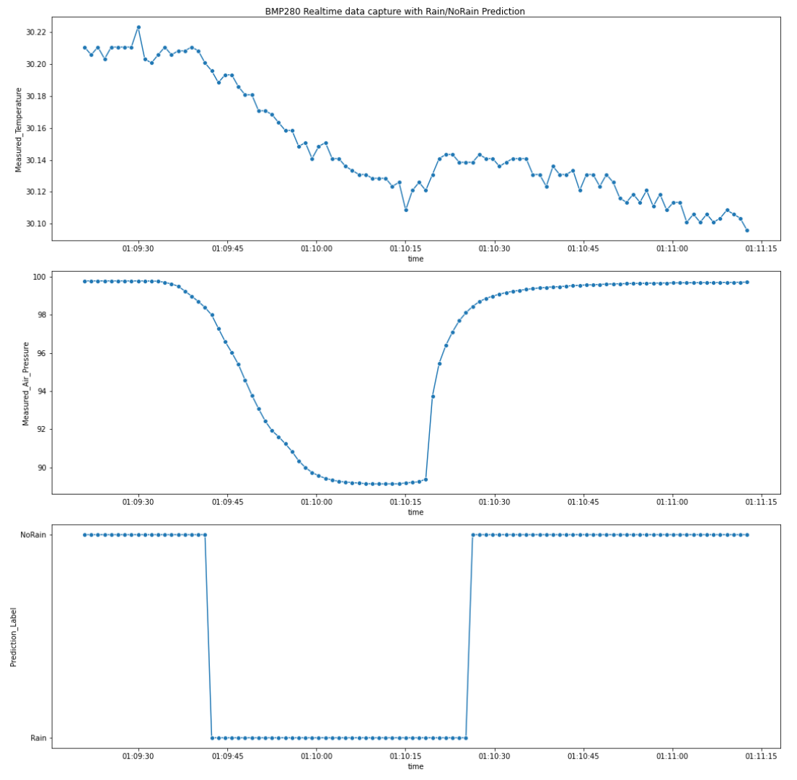

# PRG550 Assignment #2

### Assigned Week of August 08, 2022

### Due August 16,17 2022 (in-lab demonstration)

## Assignment 2 Description

In this assignment, you will use the skills gained in PRG550 to build a real-time weather prediction system using the Raspberry Pi and the BMP280.

You will perform all five stages of the data science process needed to build the system below

<p align="center">

</p>


You will used a provided notebook and code to 
- download hourly data for 1 month from Environment Canada's [historical data site](https://climate.weather.gc.ca/historical_data/search_historic_data_e.html)
- build a Rain/NoRain prediction model
- test your model with live data captured from the BMP280 temperature and pressure sensing circuit module

Three files are given to you to help you complete this assignment: 

1. [Assignment 2 Notebook](Assignment2.ipynb) - skeleton notebook
1. [assignment2_demo_students.py](assignment2_demo_students.py) - skeleton demo code
1. [prg550_assignment2_students.py](prg550_assignment2_students.py) - provided library of functions 


You are required to:
1. Read and understand the provided code, comments, and documentation in pre-populated cells.  
1. Provided needed code in the notebook and these python files 
    1. `assignment2_demo_students.py`
    1. `prg550_assignment2_students.py` 
1. Answer questions given in the notebook
1. Complete all work PRIOR to the lab session.  
    - The lab session is only for demonstration.  
    - No debugging advice will be given on 16-Aug or 17-Aug
1. Return your BMP280 at the end of the demonstration


You will need:
1. A Raspberry Pi that has been configured with PRG550 course requirements

1. Ensure you're working with the [latest version of course repository](../references/Tips_and_Tricks.md#updating-local-course-repository-from-github)
    1. Copy project files from course repo to your `~/workspace/` folder
        ```    
            cp -rp /home/pi/seneca-prg550-2022-spring/project/ /home/pi/workspace/
        ```


## Assignment Demonstration Requirements

1. Work in groups of 2
    1. Sign up for your [demonstration time slot here](https://seneca-my.sharepoint.com/:x:/r/personal/dora_lee_senecacollege_ca/_layouts/15/Doc.aspx?sourcedoc=%7BB6DEEC3E-2BD0-486B-9CFD-BA78BEC7204B%7D)

1. Before attending the demonstration session on campus, you will complete all coding and work to:

    1. perform necessary data collection, data cleaning, data preparation, data exploration
    1. use the cleaned data to build a weather classification model
    1. use the BMP280 to collect real-time data and use your weather classification model to predict whether there is Rain or NoRain

2. During live demonstration session on campus, you will be required to successfully:

    1. show and run the notebook used to collect, clean, and prepare your data
    1. show and run the notebook used to explore the data
    1. show and run the notebook used to train and save your model
    1. build and connect the needed circuitry for the BMP280 with the Pi
    1. run your completed demonstration program `assigment2_demo.py` and show that you are able to capture realtime data
    1. save captured experimental data to file: `experiment_data_YYYYMMDD_HHMMSS.csv` where
        1. `YYYYMMDD_HHMMSS` is the date and time `assigment2_demo.py` was run
        1. The contents of the file should be similar to below example
   

        ```
        Time,Measured_Temperature,Measured_Air_Pressure,Prediction,Prediction_Label
        2022-08-07 23:01:20.039109,29.971484375,98.40112069672615,0,NoRain
        2022-08-07 23:01:20.667399,29.9865234375,98.40243160711222,0,NoRain
        2022-08-07 23:01:21.293803,29.983984375,98.4000209592376,0,NoRain
        2022-08-07 23:01:21.924068,29.9865234375,98.40215749580616,0,NoRain
        2022-08-07 23:01:22.551680,29.9888671875,98.39919527174176,0,NoRain
        2022-08-07 23:01:23.177934,29.99140625,98.40052397699404,0,NoRain
        2022-08-07 23:01:23.804193,29.9814453125,98.3965378630617,0,NoRain
        ...
        ```
    1. Load data from  `experiment_data_YYYYMMDD_HHMMSS.csv` and write code to:   
        1. plot Measured_Temperature vs time 
        1. plot Measured_Pressure vs time
        1. model's prediction vs time (ie Prediction_Label)

        Your plots should be similar these three charts
        <p align="center">
        
        </p>
    1. Complete Part 2 given in the [Assignment 2 notebook](Assignment2.ipynb)
    1. Complete Part 3 given in the [Assignment 2 notebook](Assignment2.ipynb)

## Assignment Troubleshooting

1. Low voltage or other power related errors:
    - Solution: if you are using USB power, change to external AC adapter for the Pi.  Your USB may not be providing enough power (especially for laptops running without AC power)
