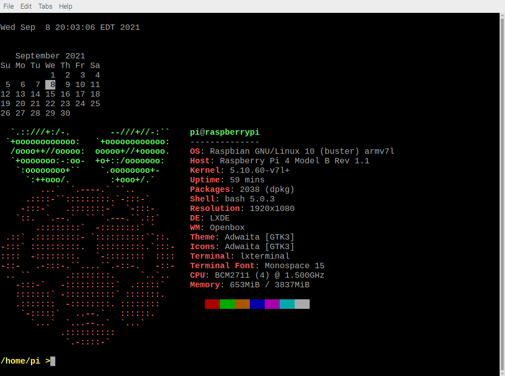

# Installing and Configuring Raspberry Pi OS for the Raspberry Pi 3B+/4

## Imaging the Raspberry Pi from PC

These notes explains how to image the OS onto an SD card ([SD Card ref](https://elinux.org/RPi_SD_cards)) for the Raspberry Pi from your PC.  For this course, we are using this image  <a href="https://downloads.raspberrypi.org/raspios_armhf/images/raspios_armhf-2021-11-08/2021-10-30-raspios-bullseye-armhf.zip" target="_blank">image</a> with specifications:

- Raspberry Pi OS Release date:   October 30th 2021
- Kernel version: 5.10
- Size:           1148 MB

Before beginning to image the Raspberry Pi review [video](https://www.youtube.com/watch?v=ntaXWS8Lk34), and [Raspberry Pi overview](https://projects.raspberrypi.org/en/projects/raspberry-pi-setting-up ) for a high level understanding of before continuing below.

## Download and install imager
1. choose and install *Raspberry Pi Imager* for your PC's operating system <a href="https://www.raspberrypi.org/software/" target="_blank">all-operating-systems</a>
1. download and unzip image (Raspberry Pi OS with desktop): <a href="https://downloads.raspberrypi.org/raspios_armhf/images/raspios_armhf-2021-11-08/2021-10-30-raspios-bullseye-armhf.zip" target="_blank">2021-10-30-raspios-bullseye-armhf.zip</a>
1. run installed imager from PC

## Configure and install Raspberry Pi image to SD card

1. Configure the imager via gear icon 
1. Image customization options: "to always use"
1. Select *Set hostname*: `rpi-<your student username>` <-- create unique hostname for connecting at the lab
1. Select *Enable SSH*: "Use password authentication"
1. Select *Set username and password*: username=pi, choose your own password
1. Select *Configure wireless LAN*: SSID=\<wifi network id\>, \<wifi network pw\>, 
1. Set the remaining options to:
    ```
    Wireless LAN country:   CA
    Timezone:   America/Toronto
    Keyboard Layout: English (US)
    ```
1. Click *SAVE*
1. Operating System:  "Use Custom" and choose unzipped image *2021-10-30-raspios-bullseye-armhf.img*
1. Storage:  choose your SD card
1. Click *Write*

# Connect and work with the Raspberry Pi

Please make sure that your Raspberry Pi has installed all updates
by executing the following commands from the command line using
the Terminal (choose yes 'Y' if prompted):
```
sudo apt update
sudo apt upgrade

git clone https://github.com/dora-lee/seneca-prg550-2022-spring.git
```

If a reboot is required, please reboot your Raspberry Pi and once
logged in, open the Terminal and continue with the instructions below:

1. back up default shell files
    ```
    mv ~/.profile ~/.profile.orig
    mv ~/.bashrc ~/.bashrc.orig
    ```

1. copy over PRG550 shell files
    ```
    cp ~/seneca-prg550-2022-spring/pi_homedir/.bashrc ~/.bashrc
    cp ~/seneca-prg550-2022-spring/pi_homedir/.profile ~/.profile
    ```
1. install some tools
    ```
    sudo apt install neofetch
    sudo apt install bsdmainutils
    ```

Once these commands have completed, close down the terminal and open it back up again.


If you see the following (or something simillar), then you've successfully completed this portion of the configuration of the
Raspberry Pi environment!
Congratulations!

```
Fri 14 Jan 2022 12:45:40 PM EST


    January 2022
Su Mo Tu We Th Fr Sa
		   1
 2  3  4  5  6  7  8
 9 10 11 12 13 14 15
16 17 18 19 20 21 22
23 24 25 26 27 28 29
30 31
  `.::///+:/-.        --///+//-:``    pi@raspberrypi
 `+oooooooooooo:   `+oooooooooooo:    --------------
  /oooo++//ooooo:  ooooo+//+ooooo.    OS: Raspbian GNU/Linux 11 (bullseye) armv7l
  `+ooooooo:-:oo-  +o+::/ooooooo:     Host: Raspberry Pi 3 Model B Rev 1.2
   `:oooooooo+``    `.oooooooo+-      Kernel: 5.10.63-v7+
     `:++ooo/.        :+ooo+/.`       Uptime: 12 days, 12 hours, 8 mins
	...`  `.----.` ``..               Packages: 1423 (dpkg)
     .::::-``:::::::::.`-:::-`        Shell: bash 5.1.4
    -:::-`   .:::::::-`  `-:::-       Resolution: 720x480
   `::.  `.--.`  `` `.---.``.::`      Terminal: /dev/pts/0
       .::::::::`  -::::::::` `       CPU: BCM2835 (4) @ 1.200GHz
 .::` .:::::::::- `::::::::::``::.    Memory: 74MiB / 922MiB
-:::` ::::::::::.  ::::::::::.`:::-
::::  -::::::::.   `-::::::::  ::::
-::-   .-:::-.``....``.-::-.   -::-
 .. ``       .::::::::.     `..`..
   -:::-`   -::::::::::`  .:::::`
   :::::::` -::::::::::` :::::::.
   .:::::::  -::::::::. ::::::::
    `-:::::`   ..--.`   ::::::.
      `...`  `...--..`  `...`
	    .::::::::::
	     `.-::::-`
```

<a href="images/result1.png"></a>


