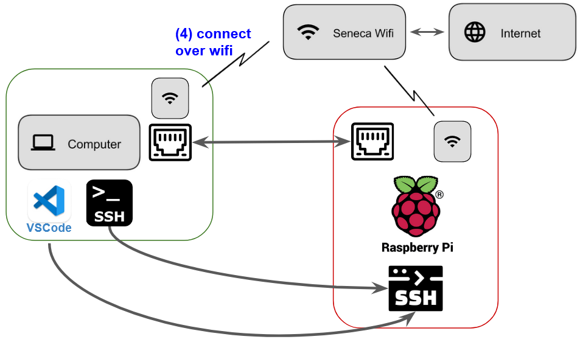

# Connecting the Raspberry Pi to Seneca's Wifi Network

The steps below will configure the Raspberry Pi for use with Seneca's wifi network `SenecaNET`.  Code and steps adapted from M. Heidenreich[^0]



1. Open a terminal to your Raspberry Pi
1. Change directory to the PRG550 course repository [^1]
    ```
    cd /home/pi/seneca-prg550-2022-spring
    ```
1. Update to latest repository content
    ```
    git pull
    cd setup
    ```
1. Run script and enter your Seneca wifi credentials at the prompts
    ```
    source seneca_wifi_config.sh > wpa_supplicant_seneca.conf
    ```
1. To allow the Raspberry Pi to connect to both your home wifi and Seneca's wifi, append the Seneca wpa configuration generated above (`wpa_supplicant_seneca.conf`) to the existing system file `/etc/wpa/wpa_supplicant.conf` 
    ```
    sudo bash -c "cat wpa_supplicant_seneca.conf >> /etc/wpa_supplicant/wpa_supplicant.conf"
    ```
1. Running `less /etc/wpa/wpa_supplicant.conf` will show that your file should look something like this
    
    ```
    country=CA
    ctrl_interface=DIR=/var/run/wpa_supplicant GROUP=netdev

    network={
            ssid="your_home_network_id"
            ... other lines ...
    }

    network={
            ssid="SenecaNET"
            ... other lines ...
    }
    ```
    
1. Reinitialize the Pi's wifi interface [^2]:
    ```
    wpa_cli -i wlan0 reconfigure
    ```
1. Verify that the Pi has successfully connected to Seneca's wifi by confirming that the `inet` field has an IP address beside it.
    ```
    ifconfig wlan0
    ```
    Your output should be similar to the below
    ```
    wlan0: flags=4163<UP,BROADCAST,RUNNING,MULTICAST>  mtu 1500
            inet 192.168.10.108  netmask 255.255.255.0  broadcast 192.168.10.255 <------ ****
            inet6 fe80::e492:d86e:31df:d0f3  prefixlen 64  scopeid 0x20<link>
            ether e4:5f:01:17:16:7e  txqueuelen 1000  (Ethernet)
            RX packets 2054  bytes 245177 (239.4 KiB)
            RX errors 0  dropped 1  overruns 0  frame 0
            TX packets 213  bytes 43184 (42.1 KiB)
            TX errors 0  dropped 0 overruns 0  carrier 0  collisions 0
    ```


[^0]:  [*WPA-EAP Config Generator*](https://matrix.senecacollege.ca/~lnx255/eap.config)

[^1]: if `/home/pi/seneca-prg550-2022-spring` directory doesn't exist, follow steps [here.](https://github.com/dora-lee/seneca-prg550-2022-spring/blob/main/setup/config-image-raspberry-pi-os.md)

[^2]: [wpa_supplicant](https://wiki.archlinux.org/title/wpa_supplicant#Connecting_with_wpa_cli)