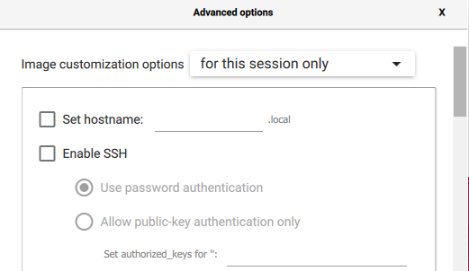
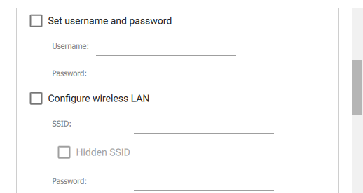
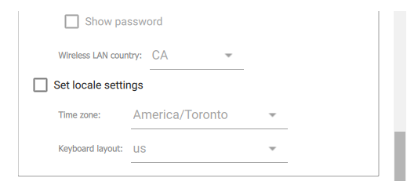
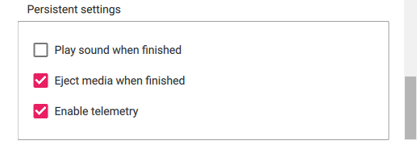

<span></span>
# Setting up PRG550 Pre-Configured ML Image

This page will guide you through steps needed to install the pre-configured course image needed to complete [Lab 5](../labs/lab05.md).

You can create this image by following the installation and configuration instructions yourself provided [here](README.md)

```diff
- **Note:**  By taking this shortcut, your grade will be reduced by 10% for the demonstration work that make use of this image
```


1. Download the [PRG550_ml_preconfigured_image_20220707.zip](http://www.doralee.ca/courses/prg550/installs/PRG550_ml_preconfigured_image_20220707.zip) to your PC (In browser, right-click the link--> 'Save link as' to save zip file locally)
1. Run the *Raspberry Pi Imager* on your PC
1. Operating System: Choose OS --> Use Custom --> select the downloaded zip file in Step 1
1. Storage: choose your SD card
1. Configure the imager via gear icon 
1. Uncheck customization fields.  Your settings shoud look like below:

    

    

    

    

1. Click *SAVE*
1. Click *WRITE*


Once the PRG550 image has been written to the SD Card, boot up your Pi and change the default hostname from `rpi-change-hostname-now` to your own:
1. start PC command line or terminal program
1. `ssh pi@rpi-change-hostname-now.local`
1. password is `student` 
1. `sudo raspi-config`
    1. System Options
        1. Hostname --> change to `rpi-useYourStudentName` (use your own student name!)
        1. Wireless LAN --> configure with your home wifi details
    1. Finish
        1. 'Yes' to reboot

Now you can ssh to the Pi using `ssh rpi-useYourStudentName.local`