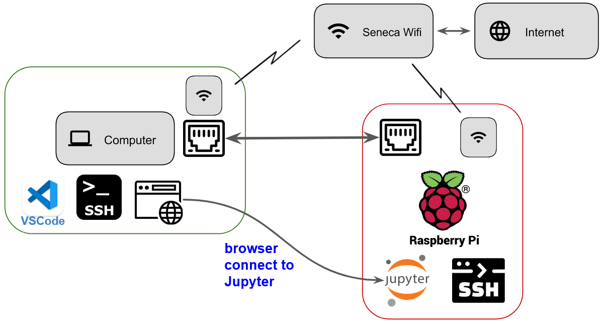

# Data Science and ML tools for the Raspberry Pi

This page will guide you through steps needed to 

1. run a Jupyter notebook server and 
1. use your PC's web browser to interactively code using notebooks.   



## Rebuild Python with ssl to resolve error `"ssl module in Python is not available" when installing package with pip3` [^1]

Run the below from the Rasberry Pi's command line:
```
sudo apt-get install libreadline-gplv2-dev libncursesw5-dev libssl-dev libsqlite3-dev tk-dev libgdbm-dev libc6-dev libbz2-dev libatlas-base-dev
```
```
cd ~/software/src/Python-3.9.9
sh configure --prefix=/home/pi/software
make && make install
```

## Install packages for machine learning environment [^2][^3]

1. Install python packages
    ```
    sudo apt-get install python3-matplotlib
    sudo apt-get install python3-scipy
    sudo apt-get install python3-numpy
    pip3 install pandas pandas-datareader scikit-learn seaborn yfinance yahoofinancials
    pip3 install bs4 requests
    ```

## Install and Connect to Jupyter Server on the Rasberry Pi [^2]

1. Install jupyter notebook environment
    ```
    pip3 install jupyter
    ```

1. Setup ssh port forwarding from your PC to the Raspberry Pi [^4].  When Jupyter starts, it normally listens to port `8888` for connections.  If your server starts up and you see a different port number, you'll need to open another ssh session with forwarding to the correct port (see example #3 below)
    ```
    ssh -L <port_on_pc>:localhost:<jupyter_port_on_pi> pi@<your_pi's_hostname>.local

    ssh -L 8888:localhost:8888 pi@<your_pi's_hostname>.local  # normal jupyter startup 

    ssh -L 8888:localhost:8889 pi@<your_pi's_hostname>.local  # if jupyter starts with port 8889
    ```

1. Start Jupyter server on Raspberry Pi in `/home/pi/workspace` directory.  `workspace` will be the root folder for the server instance.  (Create the `workspace` directory if you haven't)
    ```
    cd ~/workspace 
    jupyter notebook --no-browser
    ```

1. Once the Jupyter server starts, you'll see messages similar to below.   By default, the server starts on the Pi listening to port `8888`.  If you see a port number that is different, you'll need to open another ssh session with forwarding to the matching port (see `ssh -L` example #3 above)
    ```
    [I 12:18:36.226 NotebookApp] Serving notebooks from local directory: /home/pi/workspace
    [I 12:18:36.226 NotebookApp] Jupyter Notebook 6.4.11 is running at:
    [I 12:18:36.226 NotebookApp] http://localhost:8888/?token=7fcf706d39383de787d04a234caed47dc2c81e768c4a95d0
    [I 12:18:36.226 NotebookApp]  or http://127.0.0.1:8888/?token=7fcf706d39383de787d04a234caed47dc2c81e768c4a95d0
    [I 12:18:36.227 NotebookApp] Use Control-C to stop this server and shut down all kernels (twice to skip confirmation).
    [C 12:18:36.236 NotebookApp]

        To access the notebook, open this file in a browser:
            file:///home/pi/.local/share/jupyter/runtime/nbserver-8138-open.html
        Or copy and paste one of these URLs:
            http://localhost:8888/?token=7fcf706d39383de787d04a234caed47dc2c81e768c4a95d0
        or http://127.0.0.1:8888/?token=7fcf706d39383de787d04a234caed47dc2c81e768c4a95d0

    ```

1. From your PC's web browser connect to the indicated url.  From the above example, connect with this url:
    ```
    http://localhost:8888/?token=9b571a812c2bbca3d7f3a8d46d2a0b3085d4379cc12031db
    ```
    Note: the `ssh -L ... ` port forwarding session above must be active in order to connect to the Raspberry Pi's Jupyter server

    Your browser tab should look something like this:

    

1. Navigate to `labs` directory and create new notebook.  "New"-->"Python 3 (ipykernel)".  

    The default name is `Untitled.ipynb`, change its name and verify at command line that you can see the file.

    


1. Validate your setup by recreating notebook results below

    


[^1]: adapted from [Stack Overflow](https://stackoverflow.com/a/44758621)

[^2]: adpapted from [Setup machine learning environment in Raspberry Pi by tisutisu](https://medium.com/@tisutisu/setup-machine-learning-environment-in-raspberry-pi-bc386c6a6f40)

[^3]: to resolve `[libf77blas.so.3: cannot open shared object file: No such file or directory](https://numpy.org/devdocs/user/troubleshooting-importerror.html#raspberry-pi)` issue 

[^4]: Read more about port forwarding [here](https://help.ubuntu.com/community/SSH/OpenSSH/PortForwarding)