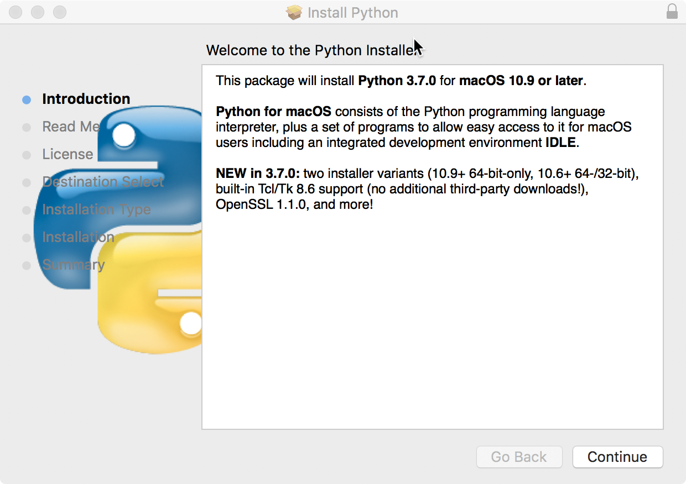
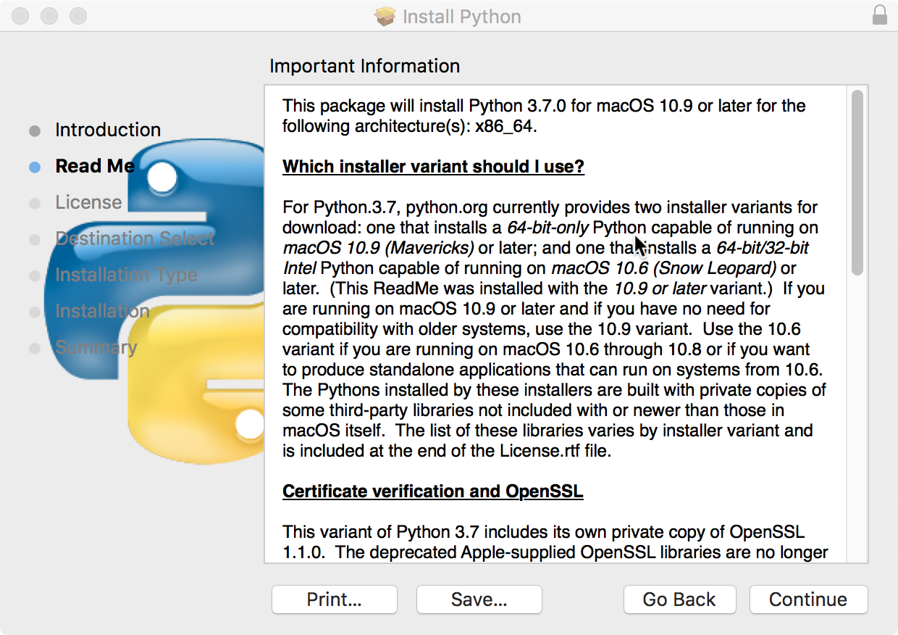
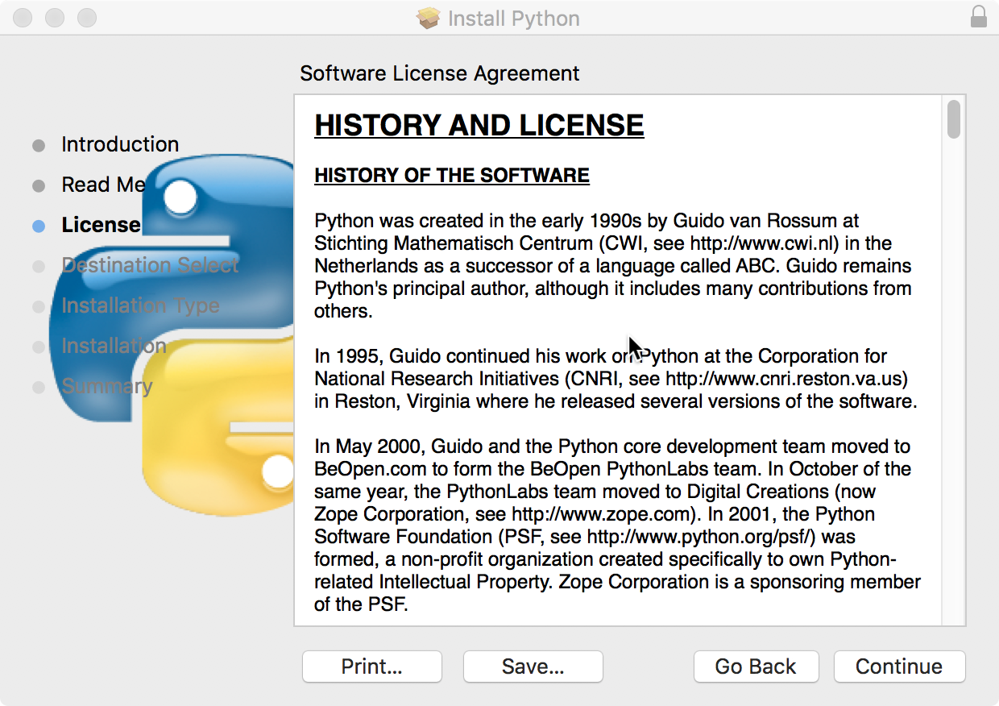
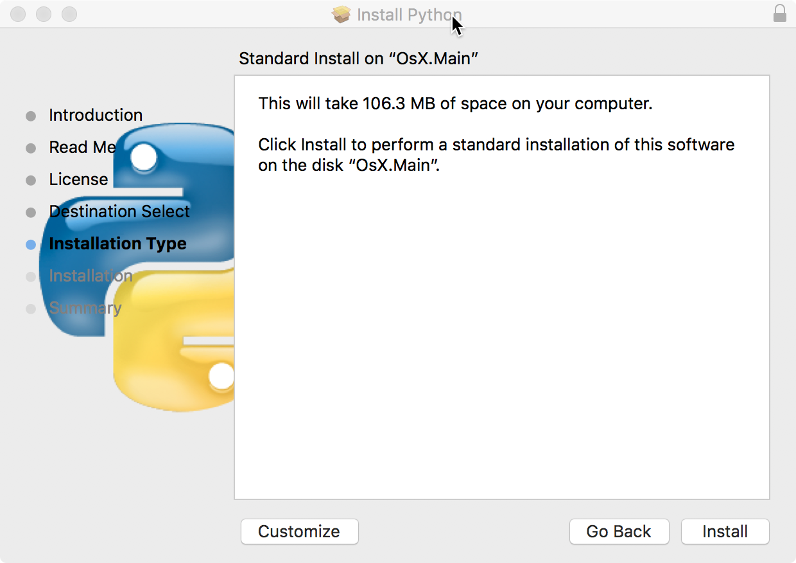
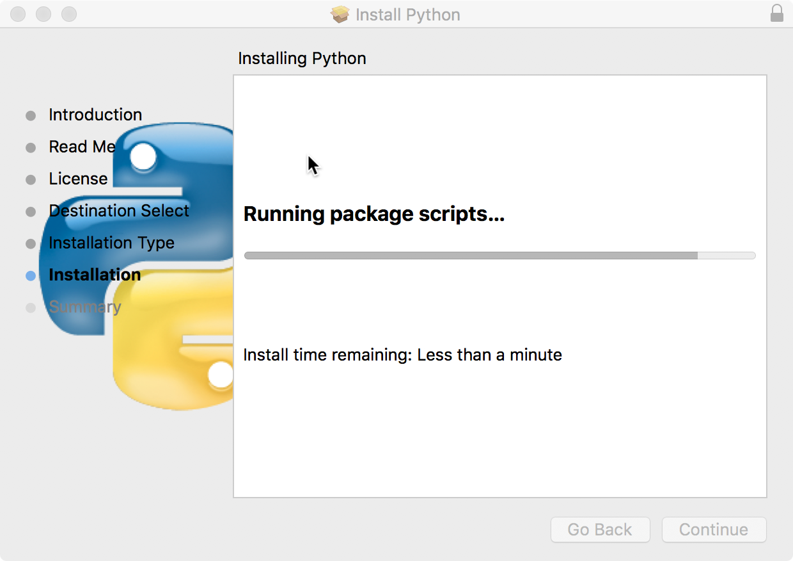
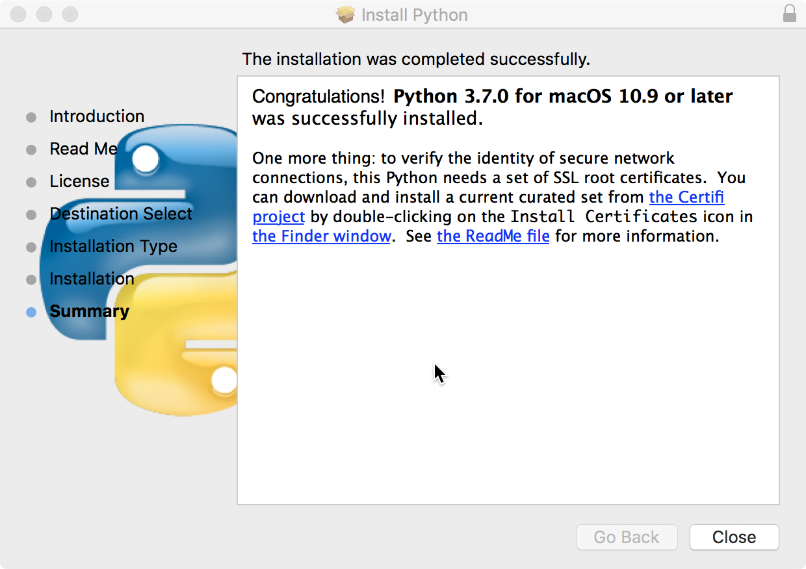
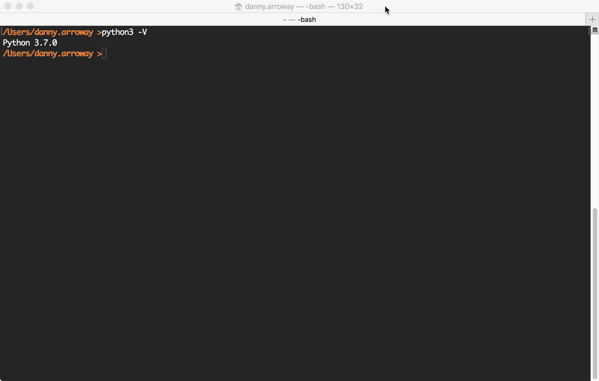

<h1>Installing Python for Mac OS X</h1>
<a href="https://www.python.org/downloads/release/python-370/" target="_blank">Python for Mac OS X</a><font color="#FF0000"><b> (Updated: Sept. 4, 2018 @ 4:35 p.m.)</b></font>

This page explains how to install the Python development environment
on your home PC/Notebook computer running Mac OS X (version 10.9 or later).
The Python interpreter and executable contains all that is required to run
and develop Python applications.

Step 1: Download the Python (version 3.7.0) 64-bit PKG executable here:

64-bit Version: <a href="https://scs.senecac.on.ca/~danny.abesdris/prg469.183/installs/python-3.7.0-macosx10.9.pkg">python-3.7.0-macosx10.9.pkg</a> (27.7 Mb)

and save the file on your computer.

Step 2: Double click on the installer program and follow the screenshots below.

<a href="images/inPyMac1.png" target="_blank"></a>

<a href="images/inPyMac2.png" target="_blank"></a>

<a href="images/inPyMac3.png" target="_blank"></a>

<a href="images/inPyMac4.png" target="_blank"></a>

<a href="images/inPyMac5.png" target="_blank"></a>

<a href="images/inPyMac6.png" target="_blank"></a>


Step 3: After installation is complete, the program should have added the
PATH to the Python interpretor in the PATH environment variable in OS X.

The installation location chosen where Python is installed is:
```/Library/Frameworks/Python.framework/Versions/3.7/bin/python3```


Step 4: Now, open a command prompt (Terminal in OS X) and type the
following line:
python -V
to make sure that Python has been properly installed.

<a href="images/pyMac2.png" target="_blank"></a>

If you see the message:
```
Python 3.7.0
```
then, congratulations, you've properly installed Python on your computer running Mac OS X!
That's it!

