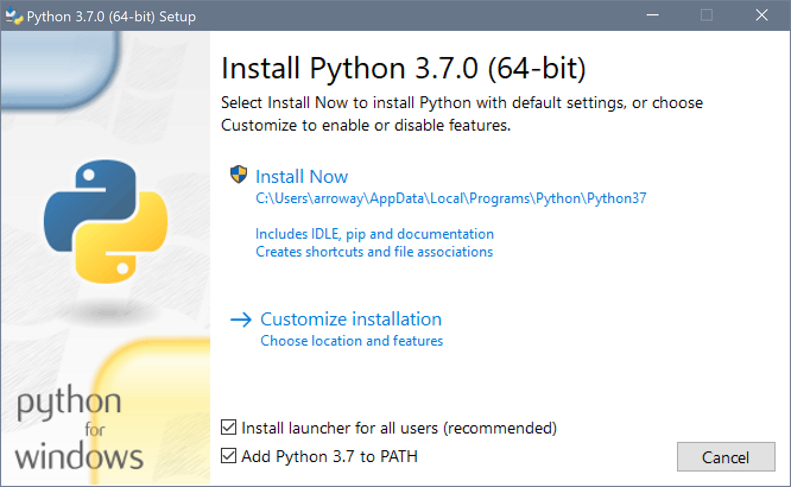
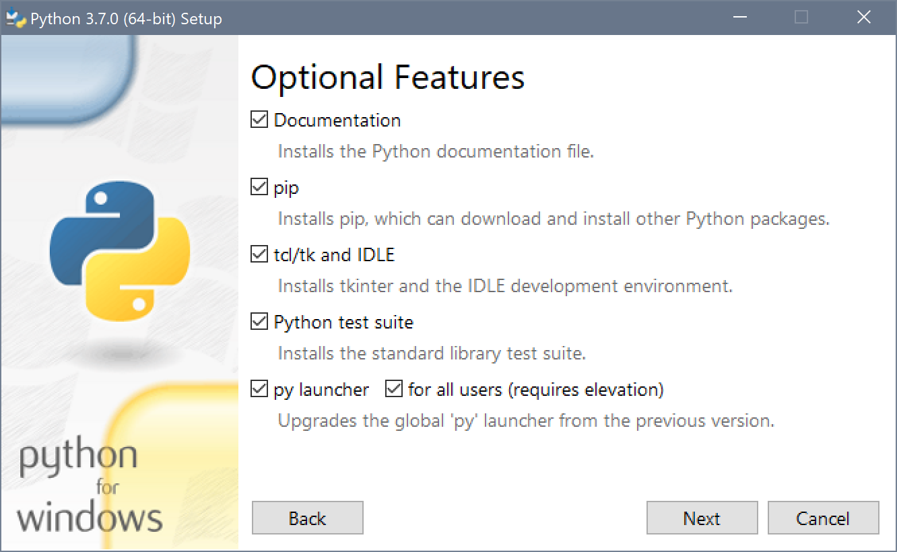
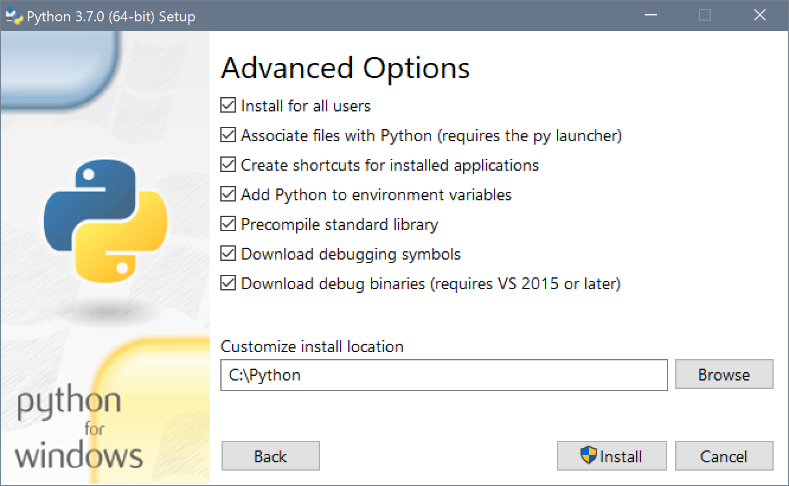
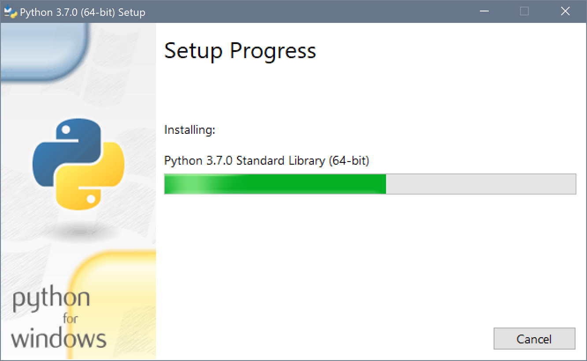
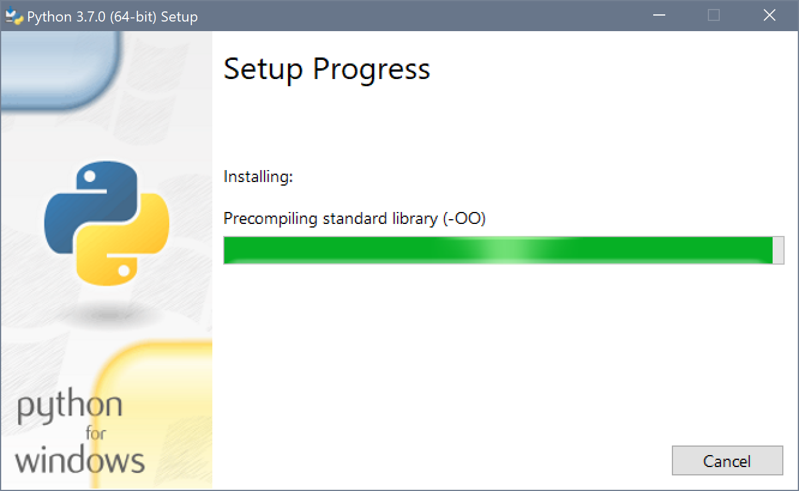
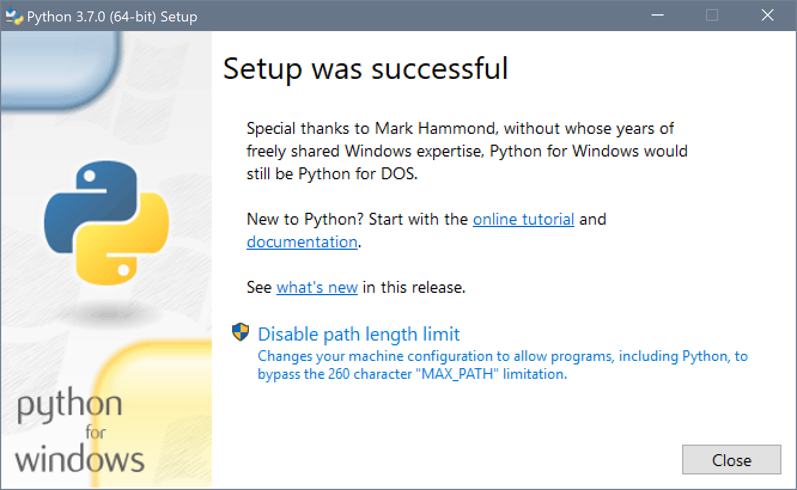
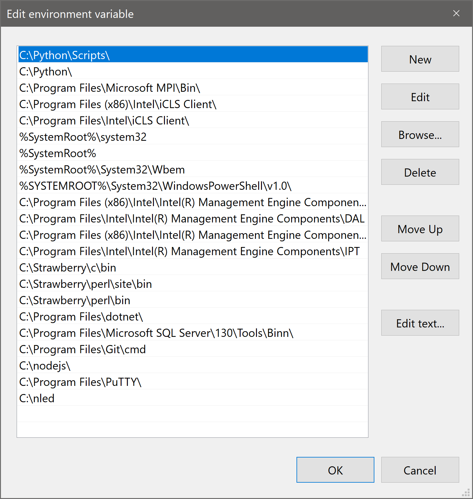

<h1>Installing Python for Windows</h1>
<a href="https://www.python.org/downloads/release/python-397/" target="_blank">Python for Windows</a><font color="#FF0000"></font>

This page explains how to install the Python development environment
on your home PC/Notebook computer running Microsoft Windows 7/8/8.1/10.
The Python interpreter and executable contains all that is required to run
and develop Python applications.

Step 1: Download the Python (version 3.9.7) 64-bit executable here:

64-bit Version: <a href="https://www.python.org/ftp/python/3.9.7/python-3.9.7-amd64.exe">python-3.9.7-amd64.exe</a> (26.3 Mb)

and save the file on your computer.

Step 2: Double click on the installer program and follow the screenshots below (images show previous 3.7.0 version).

<a href="images/inPyWin1.png" target="_blank"></a>

<a href="images/inPyWin2.png" target="_blank"></a>

<a href="images/inPyWin3.png" target="_blank"></a>

<a href="images/inPyWin4.png" target="_blank"></a>

<a href="images/inPyWin5.png" target="_blank"></a>

<a href="images/inPyWin6.png" target="_blank"></a>


Step 3: After installation is complete, the program should have added the
	PATH to the Python interpretor in the PATH environment variable in windows.
	To check this, right-click on "My Computer" or "This PC" and choose
	properties. Then click on "Advanced System Settings" and then the
	"Environment Variables" box.
	In the "System Variables" sub-window, scroll down until you see the
	"Path" variable and then click on the "Edit" button. You should see a
	window that looks like the following image below:

<a href="images/inPyWin7.png" target="_blank"></a>

Assuming the install location chosen was C:\Python, then the
path to the Python interpretor should be: ```C:\Python\python.exe```

If this is correct, you should be able to open a command prompt and type the
following line:
python -V
to make sure that Python has been properly installed.

<a href="images/pyWin2.png" target="_blank"></a>

If you see the message:
```
Python 3.9.7
```
then, congratulations, you've properly installed Python on your computer running Windows!
That's it!
