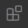

# Remote editing on Raspberry Pi with VSCode


1. Install VSCode [download here](https://code.visualstudio.com/download)
1. Go to VSCode extension manager 
1. Search for "Remote SSL", extension details should look like below:
    <a href="images/vscode-remote-ssh-extension.png" target="_blank"></a>
1. Go to VSCode "Remote Explorer" 
1. Add new ssh target '+'
    1. Enter ssh command: `ssh pi@raspberrypi.local -A`
    1. Accept update to your PC's `.ssh/config` (make note of where the path!)
1. Connecting
    1. right-click new ssh target --> connect to host in new window
    1. Remote's platform is `Linux`
    1. Enter user `pi`'s pw
    1. VSCode will configure and setup the session [^1][^2]
1. When connected, use 'Open Folder' to your home directory `/home/pi/`
    1. you will be prompted periodically to enter the pw to user `pi`

Notes

[^1]: VSCode setting
    ```
    You selected "linux" as the remote platform - this will be stored in the setting 
    "remote.SSH.remotePlatform" and can be changed there if needed.
    ```

[^2]: ignore message about file monitoring